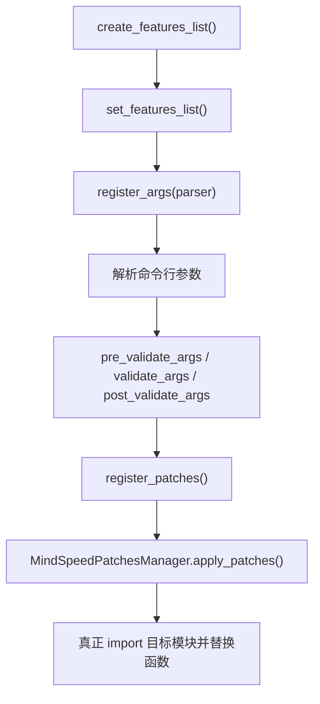

# MindSpeed 新增 Feature 接入指南

## 1. 文档目的

本文档面向需要在 MindSpeed 中新增 feature 的开发同事，说明一个新功能从“写功能逻辑”到“被 MindSpeed 启用并完成 patch”的完整接入路径。

本文档按代码调用关系组织，而不是按文件清单罗列。阅读顺序建议如下：

```text
features_manager.py
-> feature.py
-> 具体 feature 文件
-> core 功能实现文件
-> features_manager/__init__.py
-> arguments.py
-> patch_utils.py
-> 验证与可选依赖处理
```

## 2. 总体流程

MindSpeed 的 feature 接入可以理解为三层：

```text
入口调度层：决定哪些 feature 被遍历和调用
Feature 声明层：定义 feature 的参数、校验、patch 注册逻辑
功能实现层：真正替换或包装 Megatron / 第三方包函数
```

运行时主流程如下：



新增 feature 时，开发者最少需要完成：

- 新增一个 `MindSpeedFeature` 子类。
- 在子类中注册命令行参数。
- 在子类中做参数校验。
- 在子类中注册 patch。
- 将 feature 加入 `create_features_list()`。
- 将实际 patch 函数放到 `mindspeed/core/...` 或合适的功能目录。

## 3. `features_manager.py`：Feature 调度入口

文件位置：

```text
mindspeed/features_manager/features_manager.py
```

这个文件的作用是统一调度所有 feature。它不关心某个 feature 的具体功能，只负责按阶段调用 feature 的标准接口。

关键类：

```python
class MindSpeedFeaturesManager:
    FEATURES_LIST = []
```

关键方法：

```python
def register_features_args(cls, parser):
    for feature in cls.FEATURES_LIST:
        feature.register_args(parser)
```

这个方法负责让每个 feature 注册自己的命令行参数。

```python
def validate_features_args(cls, args):
    for feature in cls.FEATURES_LIST:
        feature.validate_args(args)
```

这个方法负责让每个 feature 做参数校验。

```python
def apply_features_patches(cls, mindspeed_args):
    for feature in cls.FEATURES_LIST:
        if feature.is_need_apply(mindspeed_args):
            feature.register_patches(MindSpeedPatchesManager, mindspeed_args)
    MindSpeedPatchesManager.apply_patches()
```

这个方法负责判断 feature 是否需要启用，并在启用时注册 patch。

对新增 feature 的要求：

- 不需要直接修改 `features_manager.py`。
- 需要保证你的 feature 已经被加入 `FEATURES_LIST`，否则这里不会遍历到它。
- `is_need_apply(args)` 为 `True` 时，才会调用你的 `register_patches()`。

## 4. `feature.py`：所有 Feature 的基类

文件位置：

```text
mindspeed/features_manager/feature.py
```

新增 feature 必须继承：

```python
class MindSpeedFeature:
```

构造函数：

```python
def __init__(self, feature_name: str, optimization_level: int = 2):
    self.feature_name = feature_name.lower().strip().replace('-', '_')
    self.optimization_level = optimization_level
    self.default_patches = self.optimization_level == 0
```

这里有一个重要规则：

```text
feature_name 中的 - 会被转换成 _
```

例如：

```python
super().__init__("mbridge-foo")
```

对应的参数字段就是：

```python
args.mbridge_foo
```

是否启用 feature 的逻辑：

```python
def is_need_apply(self, args):
    return (self.optimization_level <= args.optimization_level and getattr(args, self.feature_name, None)) \
        or self.default_patches
```

这意味着：

- 普通 feature 需要用户打开对应开关。
- `optimization_level=0` 的 feature 是默认 patch，即使没有显式开关也会走。
- 如果你只是新增一个用户可控功能，一般不要设置 `optimization_level=0`。

常用接口：

```python
def register_args(self, parser):
    pass
```

用于新增命令行参数。

```python
def validate_args(self, args):
    pass
```

用于检查参数是否合法。

```python
def register_patches(self, patch_manager, args):
    pass
```

用于注册真正的 patch。

```python
def pre_register_patches(self, patch_manager, args):
    pass
```

用于在 Megatron import 之前注册 patch。只有确实需要抢在 Megatron import 前生效时才使用。

对新增 feature 的要求：

- 必须继承 `MindSpeedFeature`。
- 必须在 `__init__()` 中指定 feature 名称。
- 如果需要用户手动开启，必须实现 `register_args()`。
- 如果与其它开关有依赖或互斥关系，必须实现 `validate_args()`。
- 如果需要替换函数，必须实现 `register_patches()`。

## 5. 具体 Feature 文件：定义开关、校验和 patch 注册

建议文件位置：

```text
mindspeed/features_manager/<feature_area>/<feature_name>_feature.py
```

例如新增一个适配 mbridge 的 feature：

```text
mindspeed/features_manager/mbridge/mbridge_foo_feature.py
```

最小示例：

```python
from argparse import ArgumentParser, Namespace

from mindspeed.features_manager.feature import MindSpeedFeature


class MBridgeFooFeature(MindSpeedFeature):
    def __init__(self):
        super().__init__("mbridge-foo")

    def register_args(self, parser: ArgumentParser):
        group = parser.add_argument_group(title="mbridge")
        group.add_argument(
            "--mbridge-foo",
            action="store_true",
            default=False,
            help="Enable mbridge foo adaptor."
        )

    def validate_args(self, args: Namespace):
        if args.mbridge_foo and not getattr(args, "use_mbridge", False):
            raise AssertionError("--mbridge-foo requires --use-mbridge.")

    def register_patches(self, patch_manager, args: Namespace):
        if not args.mbridge_foo:
            return

        try:
            import mbridge  # noqa: F401
        except ModuleNotFoundError as exc:
            raise RuntimeError(
                "--mbridge-foo requires package mbridge, but it is not installed. "
                "Please install mbridge or disable --mbridge-foo."
            ) from exc

        from mindspeed.core.mbridge_adaptor.foo_patch import target_func_wrapper

        patch_manager.register_patch(
            "mbridge.some.module.TargetClass.target_func",
            target_func_wrapper
        )
```

这个文件负责三件事：

- `register_args()`：给用户提供开关。
- `validate_args()`：检查开关之间的依赖和互斥。
- `register_patches()`：在功能开启时注册 patch。

需要注意：

- 可选依赖包不要在文件顶部 import。
- 例如 `mbridge`、`megatron_bridge`、`modelopt` 这类包，应该在 `register_patches()` 中延迟 import。
- 如果用户显式打开 feature 但依赖包不存在，应该报清晰错误，不建议静默跳过。

## 6. `mindspeed/core/...`：放真正的功能逻辑

建议文件位置：

```text
mindspeed/core/<feature_area>/<feature_name>.py
```

例如：

```text
mindspeed/core/mbridge_adaptor/foo_patch.py
```

如果是包装原函数，写 wrapper：

```python
from functools import wraps


def target_func_wrapper(fn):
    @wraps(fn)
    def wrapper(*args, **kwargs):
        # before logic
        output = fn(*args, **kwargs)
        # after logic
        return output

    return wrapper
```

如果是完全替换原函数，写新函数：

```python
def new_target_func(*args, **kwargs):
    # new implementation
    ...
```

然后在 feature 中注册：

```python
patch_manager.register_patch(
    "mbridge.some.module.TargetClass.target_func",
    target_func_wrapper
)
```

MindSpeed 的 patch 规则是：

- 如果 `new_func.__name__` 以 `wrapper` 或 `decorator` 结尾，会被当成装饰器包装原函数。
- 否则会被当成替换函数，直接替换目标函数。

因此命名很重要：

```python
def target_func_wrapper(fn): ...
```

会包装原函数。

```python
def target_func(...): ...
```

会替换原函数。

## 7. `features_manager/__init__.py`：把 Feature 加入总列表

文件位置：

```text
mindspeed/features_manager/__init__.py
```

这个文件负责创建 MindSpeed 默认 feature 列表。新增 feature 后必须在这里注册，否则 feature 不会被加载。

第一步，增加 import：

```python
from mindspeed.features_manager.mbridge.mbridge_foo_feature import MBridgeFooFeature
```

第二步，增加分组函数：

```python
def add_mbridge_features(features_list: List[MindSpeedFeature]):
    features_list.extend([
        MBridgeFooFeature(),
    ])
```

第三步，在 `create_features_list()` 中调用：

```python
def create_features_list():
    features_list = []
    add_megatron_basic_features(features_list)
    ...
    add_mbridge_features(features_list)
    return features_list
```

这一步决定你的 feature 是否进入 `MindSpeedFeaturesManager.FEATURES_LIST`。

如果忘了这一步，结果通常是：

- 命令行参数不会注册。
- 参数校验不会执行。
- patch 不会注册。
- 功能完全不生效。

## 8. `arguments.py`：参数注册通常不用直接改

文件位置：

```text
mindspeed/arguments.py
```

一般新增 feature 不需要直接修改这个文件，因为它已经会遍历 `FEATURES_LIST`：

```python
for feature in FEATURES_LIST:
    feature.register_args(parser)
```

也就是说，只要你在 `features_manager/__init__.py` 中把 feature 加入列表，你的 `register_args()` 就会自动被调用。

只有以下情况才考虑修改 `arguments.py`：

- 需要调整 MindSpeed 全局参数处理逻辑。
- 需要修改已有公共参数组。
- 需要在 Megatron 参数解析前后做非常特殊的兼容处理。

普通新增功能不要优先改 `arguments.py`。

## 9. `patch_utils.py`：理解 patch 何时真正生效

文件位置：

```text
mindspeed/patch_utils.py
```

Feature 中调用：

```python
patch_manager.register_patch(...)
```

只是登记 patch，不会立刻 import 目标模块，也不会马上替换函数。

真正生效发生在：

```python
MindSpeedPatchesManager.apply_patches()
```

内部会调用：

```python
Patch.parse_path(...)
```

这时才会逐级 import 目标模块：

```text
mbridge
mbridge.some
mbridge.some.module
```

因此，如果目标包不存在，默认会在 `apply_patches()` 阶段报：

```text
ModuleNotFoundError
```

`register_patch()` 常用参数：

```python
patch_manager.register_patch(
    orig_func_name,
    new_func=None,
    force_patch=False,
    create_dummy=False
)
```

含义：

| 参数 | 作用 |
| --- | --- |
| `orig_func_name` | 被 patch 的完整路径字符串 |
| `new_func` | 替换函数或 wrapper |
| `force_patch` | 是否允许覆盖已有替换函数 |
| `create_dummy` | 目标路径不存在时是否创建 dummy module |

一般建议：

- 普通 feature 不要用 `create_dummy=True`。
- 如果目标包是可选依赖，应该在 `register_patches()` 中显式检查依赖。
- 如果同一个目标函数可能被多个 feature 包装，优先使用 wrapper，而不是强制替换。
- 如果必须替换同一个函数，并且已有 patch 存在，才考虑 `force_patch=True`。

## 10. 可选依赖包的处理规范

如果 feature 依赖一个当前环境可能不存在的包，例如：

```text
mbridge
megatron_bridge
modelopt
```

不要这样写：

```python
from mbridge.some.module import TargetClass
```

因为这会在 import feature 文件时直接失败，用户即使没有打开该 feature 也可能启动失败。

推荐这样写：

```python
def register_patches(self, patch_manager, args):
    if not args.mbridge_foo:
        return

    try:
        import mbridge
    except ModuleNotFoundError as exc:
        raise RuntimeError(
            "--mbridge-foo requires mbridge. "
            "Please install mbridge or disable --mbridge-foo."
        ) from exc

    from mindspeed.core.mbridge_adaptor.foo_patch import target_func_wrapper

    patch_manager.register_patch(
        "mbridge.some.module.TargetClass.target_func",
        target_func_wrapper
    )
```

处理原则：

- 用户没开 feature：不要检查可选依赖，不要报错。
- 用户开了 feature：依赖缺失必须报清晰错误。
- 不建议静默跳过，否则用户会误以为功能已生效。
- 不建议默认使用 `create_dummy=True`，因为 dummy module 不代表功能真的可用。

## 11. 一个完整最小接入示例

目标：新增 `--mbridge-foo`，用于包装 `mbridge.some.module.TargetClass.target_func`。

第一步，新增核心逻辑：

```python
# mindspeed/core/mbridge_adaptor/foo_patch.py
from functools import wraps


def target_func_wrapper(fn):
    @wraps(fn)
    def wrapper(*args, **kwargs):
        print("[MindSpeed] mbridge foo patch enabled")
        return fn(*args, **kwargs)

    return wrapper
```

第二步，新增 feature：

```python
# mindspeed/features_manager/mbridge/mbridge_foo_feature.py
from argparse import ArgumentParser, Namespace

from mindspeed.features_manager.feature import MindSpeedFeature


class MBridgeFooFeature(MindSpeedFeature):
    def __init__(self):
        super().__init__("mbridge-foo")

    def register_args(self, parser: ArgumentParser):
        group = parser.add_argument_group(title="mbridge")
        group.add_argument("--mbridge-foo", action="store_true", default=False)

    def validate_args(self, args: Namespace):
        if args.mbridge_foo and not getattr(args, "use_mbridge", False):
            raise AssertionError("--mbridge-foo requires --use-mbridge.")

    def register_patches(self, patch_manager, args: Namespace):
        if not args.mbridge_foo:
            return

        try:
            import mbridge  # noqa: F401
        except ModuleNotFoundError as exc:
            raise RuntimeError(
                "--mbridge-foo requires mbridge. "
                "Please install mbridge or disable --mbridge-foo."
            ) from exc

        from mindspeed.core.mbridge_adaptor.foo_patch import target_func_wrapper

        patch_manager.register_patch(
            "mbridge.some.module.TargetClass.target_func",
            target_func_wrapper
        )
```

第三步，注册 feature：

```python
# mindspeed/features_manager/__init__.py
from mindspeed.features_manager.mbridge.mbridge_foo_feature import MBridgeFooFeature


def add_mbridge_features(features_list: List[MindSpeedFeature]):
    features_list.extend([
        MBridgeFooFeature(),
    ])


def create_features_list():
    features_list = []
    ...
    add_mbridge_features(features_list)
    return features_list
```

第四步，启动时添加参数：

```bash
--use-mbridge \
--mbridge-foo
```

## 12. 验证建议

新增 feature 后至少验证以下几类场景。

参数注册：

```bash
python xxx.py --help | grep mbridge-foo
```

不开 feature：

```text
不安装 mbridge，且不传 --mbridge-foo，程序不应该因为缺少 mbridge 启动失败。
```

开 feature 但缺依赖：

```text
传 --mbridge-foo，但不安装 mbridge，应报清晰错误。
```

开 feature 且依赖存在：

```text
传 --mbridge-foo，并安装 mbridge，应能进入 register_patch 和 apply_patches。
```

patch 是否生效：

```text
在 wrapper 中临时加日志，或写单元测试确认目标函数已经被包装。
```

互斥和依赖：

```text
如果 feature 依赖 --use-mbridge，需要验证未开启 --use-mbridge 时会报错。
```

回归：

```text
不使用该 feature 的普通训练脚本应保持不变。
```

## 13. 常见错误

错误一：feature 文件顶部 import 可选依赖。

```python
from mbridge.xxx import yyy
```

风险：

```text
用户没开 feature，也可能因为没装 mbridge 直接启动失败。
```

正确做法：

```python
def register_patches(...):
    if not args.mbridge_foo:
        return
    import mbridge
```

错误二：写了 feature 类，但忘了注册到 `create_features_list()`。

现象：

```text
命令行参数不存在，patch 不生效。
```

错误三：wrapper 命名不以 `wrapper` 或 `decorator` 结尾。

风险：

```text
MindSpeed 会把它当成替换函数，而不是装饰器。
```

正确做法：

```python
def target_func_wrapper(fn):
    ...
```

错误四：多个 feature 替换同一个函数时直接使用替换函数。

风险：

```text
容易发生 patch 冲突。
```

建议：

```text
能用 wrapper 就优先用 wrapper。
必须替换时，再评估 force_patch=True 是否合理。
```

错误五：依赖缺失时静默 return。

风险：

```text
用户以为功能生效，实际没有生效。
```

建议：

```text
用户显式开启 feature 后，依赖缺失必须报清晰错误。
```

## 14. 最小改动清单

新增一个标准 feature，通常需要改这些位置：

| 位置 | 是否必须 | 作用 |
| --- | --- | --- |
| `mindspeed/core/<area>/<feature>.py` | 是 | 放实际 patch 逻辑 |
| `mindspeed/features_manager/<area>/<feature>_feature.py` | 是 | 定义参数、校验和 patch 注册 |
| `mindspeed/features_manager/__init__.py` | 是 | 将 feature 加入总列表 |
| `docs/user-guide/*.md` | 建议 | 说明用户如何开启 |
| `tests/` | 建议 | 验证参数、patch 和回归 |
| `mindspeed/arguments.py` | 通常否 | 只有全局参数机制变化时才改 |
| `mindspeed/features_manager/features_manager.py` | 通常否 | 调度框架已具备，不需要为普通 feature 修改 |
| `mindspeed/patch_utils.py` | 通常否 | patch 框架已具备，不需要为普通 feature 修改 |

## 15. 结论

新增 MindSpeed feature 的关键不是只写一个 patch，而是把功能接入到 MindSpeed 的 feature 生命周期中。

推荐开发顺序：

```text
1. 先写 mindspeed/core 下的实际替换或包装逻辑
2. 再写 MindSpeedFeature 子类
3. 在 register_args 中添加用户开关
4. 在 validate_args 中处理依赖和互斥
5. 在 register_patches 中延迟检查可选依赖并注册 patch
6. 在 features_manager/__init__.py 中加入 create_features_list
7. 最后验证参数、依赖缺失、patch 生效和普通训练回归
```

对于依赖可选外部包的 feature，最重要的原则是：

```text
不要顶层 import 可选包；
用户不开 feature 时不影响启动；
用户开 feature 但缺依赖时给出明确错误；
依赖存在时再注册 patch。
```
