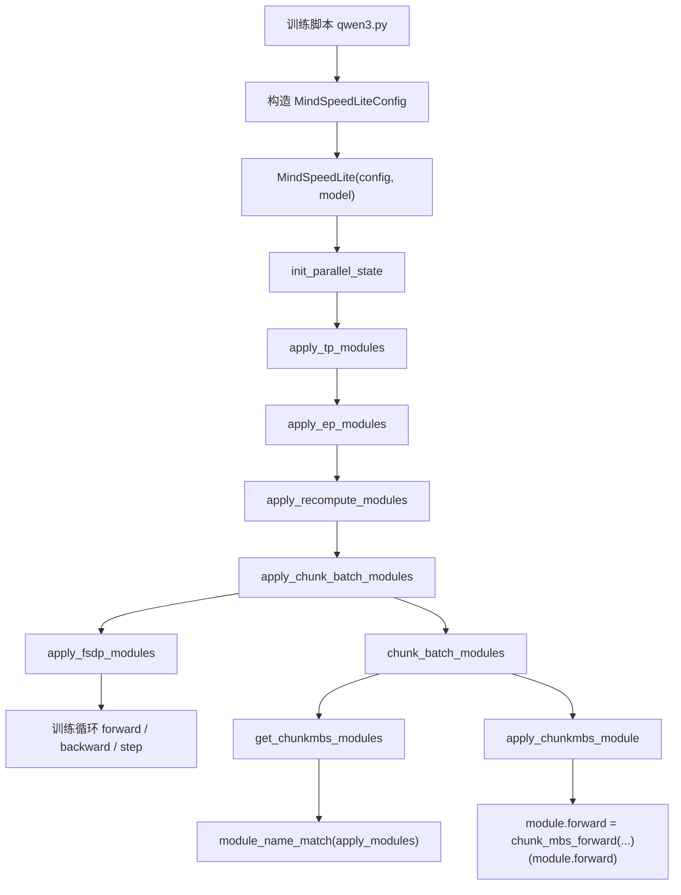
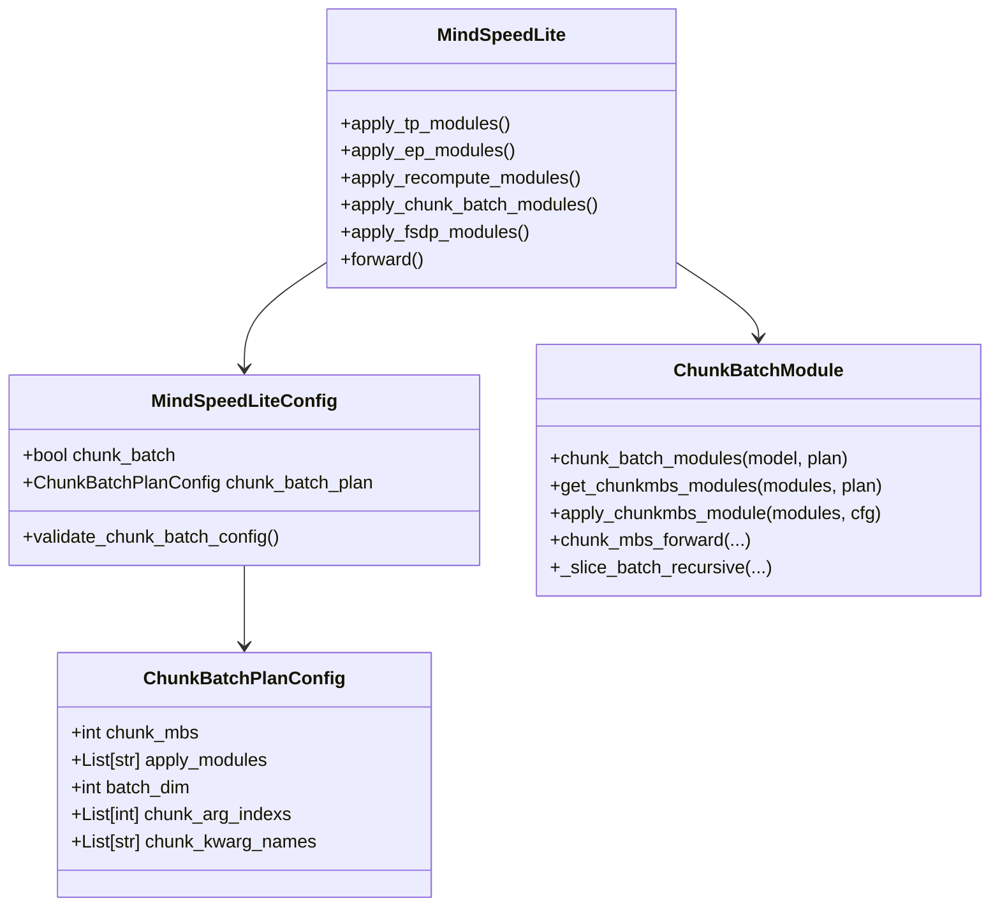
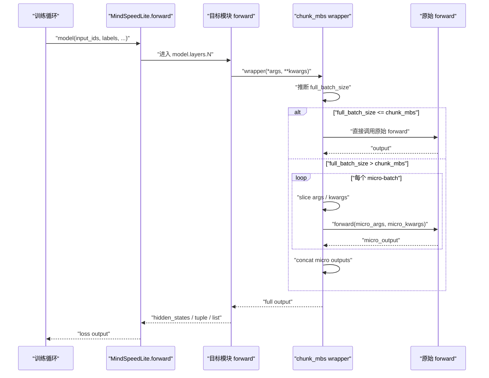
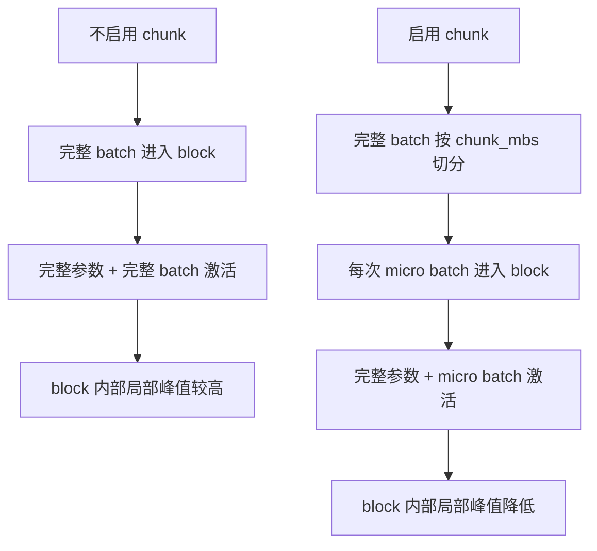

# MindSpeed Lite Chunk Batch Size 功能设计文档

## 1. 摘要

本文档描述 MindSpeed Lite 中 `chunk batch size` 功能的设计方案。该功能面向大模型训练中的显存峰值优化场景，通过在指定模块级别对 batch 维输入进行 micro-batch 切分，使单个 transformer block 在一次 forward 中只处理较小 batch，从而降低 block 内部激活工作集峰值。

本设计已在代码实现后反向整理，当前实现位于 MindSpeed Lite 的 `mindspeed/lite/memory/chunk_batch/`，并通过 `MindSpeedLiteConfig` 和 `MindSpeedLite` 主流程接入。功能默认以模块名模式匹配方式选择目标模块，例如 `model.layers.{*}`，适合应用在 transformer decoder layer 级别。

需要明确的是，本功能不是 dataloader 层面的 batch 切分，也不是梯度累积；它不会改变外层训练 step 的语义。它实现的是模块级 forward chunking：对目标模块的输入进行切分，依次执行原始 forward，最后将输出拼接为完整 batch 的结果。

## 2. 功能概述

### 2.1 背景

在 FSDP2 训练场景中，模型参数通常以 shard 形式分布在多张卡上。当执行某个被 FSDP 包裹的模块时，该模块的参数会在当前执行阶段被 all-gather 成可计算的完整参数视图。对于参数规模较大的 transformer block，forward 阶段的显存峰值常由以下几部分叠加形成：

```text
当前 block all-gather 后的完整参数
+ 当前 block 处理完整 batch 产生的激活
+ 通信、copy、临时 buffer
+ 其它运行时缓存
```

当模型较宽、block 参数量较大，或者 batch size、sequence length 较高时，完整参数与完整 batch 激活叠加会导致显存峰值过高，进而限制 micro batch size 或 sequence length 的提升。

### 2.2 目的

本功能的目标是在不改变训练主循环、不改变 dataloader batch 语义的前提下，对指定模块的 forward 输入进行 batch 维切分。以 `BATCH_SIZE=8`、`chunk_mbs=2` 为例，原本一次进入目标 block 的 batch 会被拆为 4 次 micro forward：

```text
input[0:2] -> block forward
input[2:4] -> block forward
input[4:6] -> block forward
input[6:8] -> block forward
cat(outputs) -> full output
```

这样可降低目标模块单次 forward 内部处理的激活规模。功能预期收益主要体现在 block 内部激活工作集较大的场景，尤其适合与 FSDP2、recompute 等显存优化策略组合使用。

### 2.3 非目标

本功能不解决以下问题：

- 不实现每个 micro-batch forward 后立即 backward。
- 不替代梯度累积。
- 不改变 dataloader 的 batch 组织方式。
- 不保证所有模型输出结构都能自动拼接。
- 不直接降低 FSDP 参数 all-gather 的参数体积。
- 不直接解决 optimizer state 显存占用。

## 3. 术语说明

| 名称 | 含义 |
| --- | --- |
| `chunk_mbs` | 目标模块内部每次 micro forward 处理的 batch 大小 |
| `batch_dim` | 需要切分的 batch 维度，通常为 `0` |
| `apply_modules` | 需要应用 chunk batch wrapper 的模块名匹配规则 |
| `chunk_arg_indexs` | 需要按 batch 维切分的位置参数下标列表 |
| `chunk_kwarg_names` | 需要按 batch 维切分的关键字参数名称列表 |
| block 级模块 | transformer layer / decoder layer 级模块，例如 `model.layers.0` |
| direct path | 当 `full_batch_size <= chunk_mbs` 时，不切分，直接调用原始 forward |

## 4. 实现思路描述

### 4.1 功能落点

功能落在 MindSpeed Lite 的 `memory` 子模块中：

```text
mindspeed/lite/memory/chunk_batch/
```

原因如下：

- 该功能本质是模块级显存优化，与 recompute、activation swap 等能力属于同类。
- 它通过替换模块 forward 实现，不应侵入 dataloader、optimizer 或 FSDP 内部实现。
- 它需要按模块名选择目标模块，与 MindSpeed Lite 现有 `recompute`、`TP`、`EP`、`FSDP` 配置风格一致。

### 4.2 包装顺序

MindSpeedLite 当前模型改造顺序为：

```text
TP -> EP -> recompute -> chunk_batch -> FSDP
```

该顺序满足以下设计意图：

- `TP/EP` 先完成模块内部并行改造。
- `recompute` 先包装原始 forward。
- `chunk_batch` 包在 recompute 外层，使每个 micro forward 进入 recompute 包装后的计算路径。
- `FSDP` 最后包裹模块，使最终结构保持在 FSDP 管理范围内。

逻辑嵌套关系可理解为：

```text
FSDP( ChunkBatch( Recompute( original_forward ) ) )
```

### 4.3 输入切分策略

当前设计不默认切分所有输入，而是要求配置显式指定哪些 `args` 或 `kwargs` 需要切分：

```python
ChunkBatchPlanConfig(
    chunk_mbs=1,
    apply_modules=["model.layers.{*}"],
    batch_dim=0,
    chunk_arg_indexs=[0],
    chunk_kwarg_names=[],
)
```

这样做的原因是 transformer layer 的 forward 输入中可能包含非 batch 维 tensor，例如 `cache_position`、`position_ids`、`past_key_values` 等。如果默认递归切分所有 tensor，容易切错输入，导致 shape mismatch 或位置编码错误。

### 4.4 输出拼接策略

每个 micro forward 的输出会被收集到 `outputs` 列表中，然后按输出结构递归拼接：

- `Tensor`：使用 `torch.cat(outputs, dim=batch_dim)`。
- `tuple`：按元素递归拼接。
- `list`：按元素递归拼接。
- `None`：直接返回 `None`。
- 其它相同标量：所有 chunk 输出一致时返回第一个。

如果输出类型不支持拼接，会抛出 `TypeError`，避免静默产生错误结果。

## 5. 实现设计

### 5.1 总体架构图



### 5.2 模块关系图



### 5.3 运行时序图



### 5.4 显存收益模型



需要注意，`torch.npu.max_memory_allocated()` 统计的是整个 step 的全局峰值，可能被 FSDP all-gather、optimizer step、allocator cache 等其它阶段覆盖。因此该指标不一定能直接体现 block 内部局部峰值变化。验证时应结合 OOM 边界、batch/sequence 扩展能力、profiler 或局部 instrumentation 判断收益。

## 6. 关键接口设计

### 6.1 `ChunkBatchPlanConfig`

```python
@dataclass
class ChunkBatchPlanConfig:
    chunk_mbs: int = None
    apply_modules: List[str] = None
    batch_dim: int = 0
    chunk_arg_indexs: List[int] = None
    chunk_kwarg_names: List[str] = None
```

字段说明：

| 字段 | 类型 | 是否必填 | 说明 |
| --- | --- | --- | --- |
| `chunk_mbs` | `int` | 开启功能时必填 | 每个 micro forward 处理的 batch 大小 |
| `apply_modules` | `List[str]` | 开启功能时必填 | 目标模块匹配规则 |
| `batch_dim` | `int` | 否 | batch 所在维度，默认 `0` |
| `chunk_arg_indexs` | `List[int]` | 否 | 需要切分的位置参数下标 |
| `chunk_kwarg_names` | `List[str]` | 否 | 需要切分的关键字参数名 |

### 6.2 `MindSpeedLiteConfig`

新增字段：

```python
chunk_batch: bool = False
chunk_batch_plan: Optional[ChunkBatchPlanConfig] = None
```

新增校验逻辑：

```text
chunk_batch=True 时：
- chunk_mbs 不能为空
- chunk_mbs 必须大于 0
- apply_modules 不能为空

无论是否开启：
- apply_modules 默认归一化为空列表
- chunk_arg_indexs 默认归一化为空列表
- chunk_kwarg_names 默认归一化为空列表
```

### 6.3 `chunk_batch_modules(model, plan)`

职责：

- 根据 `plan.apply_modules` 查找目标模块。
- 将每个目标模块的 `forward` 替换为 chunk wrapper。
- 返回改造后的 model。

### 6.4 `get_chunkmbs_modules(modules, plan)`

职责：

- 遍历 `modules.named_modules()`。
- 使用 `module_name_match` 匹配模块名。
- 若没有命中任何模块，抛出异常，避免用户误以为功能已生效。

典型匹配：

```python
apply_modules=["model.layers.{*}"]
```

可命中：

```text
model.layers.0
model.layers.1
model.layers.2
...
```

### 6.5 `chunk_mbs_forward(...)`

职责：

- 以 decorator 形式包装原始 forward。
- 推断完整 batch size。
- 当 `full_batch_size <= chunk_mbs` 时走 direct path。
- 当 `full_batch_size > chunk_mbs` 时循环切分并执行 micro forward。
- 拼接 micro outputs 并返回。

核心流程：

```text
infer full_batch_size
if full_batch_size <= chunk_mbs:
    return forward_func(*args, **kwargs)

for each micro:
    slice configured args / kwargs
    out = forward_func(*micro_args, **micro_kwargs)
    outputs.append(out)

return concat(outputs)
```

### 6.6 `_slice_batch_recursive(...)`

职责：

- 对嵌套输入结构进行 batch 维切片。
- 支持 `Tensor`、`tuple`、`list`、`dict`。
- 对非 Tensor、非容器类型保持原样。

示例：

```python
_slice_batch_recursive(hidden_states, 0, 1, batch_dim=0)
```

可将 `[B, S, H]` 切为 `[1, S, H]`。

## 7. 配置示例

### 7.1 transformer block 级 chunk

```python
config = MindSpeedLiteConfig(
    chunk_batch=True,
    chunk_batch_plan=ChunkBatchPlanConfig(
        chunk_mbs=1,
        apply_modules=["model.layers.{*}"],
        batch_dim=0,
        chunk_arg_indexs=[0],
        chunk_kwarg_names=[],
    ),
)
```

### 7.2 与 FSDP 和 recompute 组合

```python
config = MindSpeedLiteConfig(
    fully_shard_parallel_size=8,
    fsdp_plan=FSDPPlanConfig(
        ignored_modules=[],
        apply_modules={"model.layers.{*}": {}},
    ),
    recompute=True,
    recompute_plan=["model.layers.{*}"],
    chunk_batch=True,
    chunk_batch_plan=ChunkBatchPlanConfig(
        chunk_mbs=1,
        apply_modules=["model.layers.{*}"],
        batch_dim=0,
        chunk_arg_indexs=[0],
        chunk_kwarg_names=[],
    ),
)
```

## 8. 与其它能力的关系

### 8.1 与 FSDP2

chunk batch 应在 FSDP2 包装前完成 forward 替换，使最终目标模块仍由 FSDP2 管理。这样可在 FSDP 的参数 all-gather 语义下，将目标模块的激活工作集拆小。

### 8.2 与 recompute

chunk batch 位于 recompute 外层。每个 micro forward 会进入 recompute wrapper，从而形成更细粒度的 recompute 单元。该组合可进一步降低前向保存激活的压力。

### 8.3 与 EP/TP

EP/TP 会先于 chunk batch 应用。chunk batch 默认只切指定输入，避免误切 DTensor、位置编码或 MoE router 相关 tensor。若后续发现某些模型在 TP/EP 场景下需要处理 DTensor 输入，应单独扩展 DTensor-aware slicing 策略。

### 8.4 与 optimizer

chunk batch 不改变 optimizer 行为。optimizer 仍基于完整 loss 的 backward 结果执行参数更新。

## 9. 兼容性与边界

当前实现的兼容范围：

- 支持目标模块输入为位置参数或关键字参数。
- 支持递归切分 `Tensor`、`tuple`、`list`、`dict`。
- 支持输出为 `Tensor`、`tuple`、`list`、`None` 或一致标量。
- 支持 `full_batch_size <= chunk_mbs` 的 direct path。

当前边界：

- 不支持任意自定义输出对象自动拼接，例如复杂 `ModelOutput`。
- 不保证所有 attention mask、position ids、cache 结构都可直接切分。
- 对 DTensor 输入未做专门适配。
- 由于不是立即 backward，不能完全释放每个 micro 的整条计算图。
- 对全局 step 峰值的收益依赖场景，可能被参数、optimizer、通信 buffer 等其它峰值覆盖。

## 10. 验证设计

### 10.1 单元级验证

构造 toy model：

```text
ToyModel
└── model
    └── layers
        ├── 0
        ├── 1
        └── 2
```

验证项：

- `apply_modules=["model.layers.{*}"]` 能命中目标模块。
- `BATCH_SIZE=8`、`chunk_mbs=2` 时每层 forward 调用 4 次。
- chunk 前后 output 一致。
- chunk 前后 loss 一致。
- chunk 前后参数梯度一致。

### 10.2 集成级验证

使用 Qwen3 验证脚本：

```bash
mindspeed/lite/qwen3.py
```

基础验证顺序：

```text
1. chunk_batch=False，确认 baseline 可完成 forward/backward/step。
2. chunk_batch=True，BATCH_SIZE > CHUNK_MBS，确认 chunk wrapper 生效。
3. 对比同 batch 下 chunk off/on 的可跑性和 max memory。
4. 逐步增加 MAX_LENGTH 或 BATCH_SIZE，观察 OOM 边界变化。
```

### 10.3 生效判定

日志中应出现：

```text
Applying chunkmbs to N modules with chunk_mbs=X
Applying chunkmbs to module: model.layers.0
```

若 `BATCH_SIZE <= CHUNK_MBS`，wrapper 会进入 direct path，不会实际切分。真正验证 chunk 行为必须满足：

```text
BATCH_SIZE > CHUNK_MBS
```

### 10.4 显存验证注意事项

`torch.npu.max_memory_allocated()` 是当前进程的 allocator 峰值，不能直接等价于某个 block forward 的局部峰值。为提升可解释性，验证脚本应在每个 step 前调用：

```python
torch.npu.reset_peak_memory_stats()
```

同时建议记录：

- 是否 OOM。
- 同 batch 下 chunk off/on 的 step 峰值。
- 增大 `MAX_LENGTH` 后的峰值变化。
- chunk 是否提升可运行的 batch/sequence 上限。

## 11. 风险分析

| 风险 | 影响 | 缓解措施 |
| --- | --- | --- |
| 输出结构不支持拼接 | 运行时报 `TypeError` | 先限定目标为 decoder layer；必要时扩展 `ModelOutput` 支持 |
| 输入切分字段配置错误 | shape mismatch 或语义错误 | 默认只切 `hidden_states`；遇到明确报错再增加 `chunk_kwarg_names` |
| `BATCH_SIZE <= CHUNK_MBS` | 功能不实际切分 | 验证命令强制使用 `BATCH_SIZE > CHUNK_MBS` |
| 全局峰值无变化 | 用户误判功能无效 | 结合 OOM 边界、profiler、step 内峰值和局部日志分析 |
| 与 TP/EP DTensor 交互复杂 | DTensor/Tensor 混用报错 | 先验证 FSDP/recompute 基线；后续单独设计 DTensor-aware 处理 |
| 计算开销增加 | 多次 forward 导致吞吐下降 | 该功能以显存换计算，需在大 batch/长序列场景中使用 |

## 12. 后续优化方向

1. 增加一次性 debug 日志，打印 `full_batch_size`、`chunk_mbs`、`num_micros`，便于确认是否真实切分。
2. 支持 Hugging Face `ModelOutput` 等复杂输出结构。
3. 增加 DTensor-aware slicing，增强 TP/EP 组合场景兼容性。
4. 增加 profiling hook，统计目标模块级别的局部峰值，而不只依赖 step 级全局峰值。
5. 增加自动推断 batch tensor 的可选能力，但默认仍保留显式配置以保证安全。
6. 研究 chunked loss / immediate backward 版本，用于进一步降低完整计算图生命周期显存。

## 13. 结论

`chunk batch size` 功能通过模块级 forward wrapper 的方式，将指定 transformer block 的输入 batch 切分为多个 micro-batch 依次执行，并将输出拼回完整 batch。该设计与 MindSpeed Lite 现有配置体系、模块匹配机制和显存优化模块组织方式一致，能在不改变训练主循环语义的前提下，为 FSDP2 大 block 场景提供额外的激活峰值控制手段。

当前实现适合作为第一版功能验证版本。后续应重点补充复杂输出结构支持、DTensor 组合场景兼容性和更精细的显存 profiling 能力。
