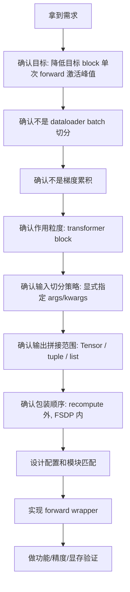

# MindSpeed Lite Chunk Batch Size 需求分析文档

## 1. 摘要

本文档从开发人员视角分析 `chunk batch size` 需求：当开发者第一次拿到该需求时，应该如何理解它要解决什么问题、它和现有训练流程有什么关系、需要确认哪些边界、可能有哪些技术风险，以及最终应该如何判断需求是否完成。

该需求的核心不是“把 dataloader 的 batch 拆小”，也不是“增加梯度累积”。它要解决的是在 FSDP2 训练大模型时，某些 transformer block 在一次 forward 中处理完整 batch 导致激活峰值过高的问题。需求希望在指定模块内部，把 batch 维输入切成多个 chunk，逐个执行该模块 forward，再把输出拼回完整 batch，从而降低目标模块单次 forward 的激活工作集峰值。

## 2. 需求原始理解

### 2.1 原始描述中的关键信息

原始需求可以拆成几句话理解：

```text
FSDP2 会极致压缩参数显存，然后通过提高 mbs 或 seqlen 提高每个 block 的计算量。
```

这说明需求背景是 FSDP2 大模型训练，重点关注单个 transformer block 的计算和显存。

```text
每个 block 前向会有一次 allgather，反向会有一次 allgather 和一次 reduce scatter，同时每个 block 还有一次 copy out。
```

这说明在 FSDP2 下，每个 block 的运行不是单纯计算，还叠加了通信和参数重构开销。

```text
当模型参数量特别大，或者模型特别宽时，参数和临时 buffer 会占据很多显存，留给激活值的空间不足。
```

这说明需求的直接痛点是显存峰值过高，导致 batch size 或 sequence length 上不去。

```text
在 batch size 维度进行切分，然后每个 micro batch size 算完前向之后直接计算反向。
```

这句话表达了希望降低单次处理 batch 的规模。但结合参考代码，实际实现更接近“模块内部 forward chunking”，并不是训练主循环层面的每个 micro batch 立刻 backward。

```text
写一个 wrapper，对输入进行 chunk，注意这个 wrapper 要在重计算的外面，fully_shard 的里面。
```

这句话是最关键的实现约束：功能应以 wrapper 形式作用在模块 forward 上，并且需要明确与 recompute、FSDP 的包装顺序。

### 2.2 开发人员应提炼出的目标

拿到需求后，开发人员应先把它提炼为明确目标：

- 在 MindSpeed Lite 中新增一个可配置的模块级 batch chunk 功能。
- 用户可以指定哪些模块应用该功能，例如 `model.layers.{*}`。
- 用户可以指定 chunk 大小，例如 `chunk_mbs=1` 或 `chunk_mbs=2`。
- 用户可以指定哪些输入参数需要按 batch 维切分。
- 每个 chunk 依次调用原模块 forward。
- 多个 chunk 的输出按 batch 维拼接，外部看到的输出形状和不切分时一致。
- 功能应放在 recompute 外层、FSDP 内层。
- 默认不改变训练主循环、dataloader、optimizer 和 loss 计算语义。

## 3. 需求要解决什么问题

### 3.1 显存峰值来源

在 FSDP2 场景中，一个 transformer block 执行时通常会产生以下显存占用：

```text
当前 block all-gather 后的完整参数
+ 当前 block 的激活值
+ 通信 buffer
+ copy / 临时 tensor
+ 框架运行时缓存
```

当模型较宽或单个 block 参数量很大时，参数和 buffer 已经占用较多显存。如果同时让该 block 一次处理较大的 batch 或较长的 sequence，就容易产生 OOM。

### 3.2 为什么切 batch 维可能有帮助

对于目标模块来说，激活值通常与 batch size 近似正相关：

```text
batch 越大 -> 单次 forward 的激活越大
batch 越小 -> 单次 forward 的激活越小
```

如果原来一次 forward 处理 `B=8`：

```text
block(input[0:8])
```

改为 chunk 后：

```text
block(input[0:2])
block(input[2:4])
block(input[4:6])
block(input[6:8])
cat(outputs)
```

对外仍然是 batch 8 的输出，但目标 block 内部每次只处理 batch 2。这样可以降低单次 forward 内部的激活峰值。

### 3.3 这个需求不解决什么

开发人员需要避免把需求扩大化。该功能不解决：

- 不降低模型总参数量。
- 不降低 optimizer state 显存。
- 不减少 FSDP all-gather 的参数总量。
- 不改变 dataloader 的 batch size。
- 不等价于梯度累积。
- 不保证所有模型都能获得明显收益。
- 不保证所有复杂输出结构都能自动拼接。

## 4. 与现有概念的区别

### 4.1 与 dataloader batch size 的区别

dataloader batch size 是外层训练 step 输入的数据量。

chunk batch size 是目标模块内部一次 forward 处理的数据量。

例如：

```text
dataloader batch size = 8
chunk_mbs = 2
```

外层训练仍然认为当前 step 的 batch 是 8，但进入被包装模块时，会拆成 4 个 chunk。

### 4.2 与梯度累积的区别

梯度累积通常是：

```text
micro batch 1 forward/backward
micro batch 2 forward/backward
...
optimizer.step()
```

chunk batch size 当前设计是：

```text
同一个训练 batch
-> 目标模块内部拆 chunk forward
-> 拼接输出
-> 外层继续完整 forward
-> 最后正常 backward
```

所以它不改变 optimizer step 的频率，也不改变 loss 汇总方式。

### 4.3 与 recompute 的区别

recompute 是反向阶段重新计算部分 forward，以减少保存激活。

chunk batch size 是 forward 阶段减少单次模块处理的 batch 大小。

二者可以组合：

```text
FSDP( ChunkBatch( Recompute( original_forward ) ) )
```

这样每个 chunk 内部走 recompute 包装后的 forward。

### 4.4 与 FSDP 的区别

FSDP 关注参数 shard 和通信。

chunk batch size 关注目标模块内部激活峰值。

因此它不应该侵入 FSDP 内部，而应该在模块 forward 层做包装，并让 FSDP 管理最终包装后的模块。

## 5. 开发人员需要确认的问题

### 5.1 功能应该作用在哪些模块

第一个问题是：chunk 应该包在哪一层？

可选层级包括：

- 整个模型。
- transformer block。
- attention 子模块。
- MLP 子模块。
- expert 子模块。

结合需求背景，推荐优先作用在 transformer block 级别，例如：

```text
model.layers.{*}
```

原因：

- block 是 FSDP all-gather 和 recompute 常见的包装粒度。
- block 输入输出通常以 hidden states 为主，比较容易按 batch 维切分和拼接。
- 粒度太大可能收益不稳定，粒度太小会增加配置复杂度。

### 5.2 哪些输入需要切分

不能简单地把所有 tensor 都切分。原因是 transformer forward 中可能有一些 tensor 不是 batch 维语义，例如：

- `position_ids`
- `cache_position`
- `past_key_values`
- attention mask 的某些维度
- routing 或 expert metadata

因此需求应支持显式配置：

```python
chunk_arg_indexs=[0]
chunk_kwarg_names=[]
batch_dim=0
```

这样用户可以明确告诉系统哪些输入按 batch 维切分。

### 5.3 输出如何拼接

开发人员需要分析目标模块的输出类型：

- 如果输出是 `Tensor`，可以直接 `torch.cat`。
- 如果输出是 `tuple` 或 `list`，需要逐项拼接。
- 如果输出包含 `None`、标量、cache 对象或自定义类，就需要明确是否支持。

需求初版不应承诺支持所有复杂输出结构。建议先支持常见输出，并在不支持时显式报错。

### 5.4 包装顺序如何确定

需求明确说 wrapper 要在 recompute 外面、fully_shard 里面。

开发人员应转化为 MindSpeed Lite 初始化顺序：

```text
TP -> EP -> recompute -> chunk_batch -> FSDP
```

对应嵌套关系：

```text
FSDP( ChunkBatch( Recompute( original_forward ) ) )
```

如果顺序错了，可能出现：

- chunk 没有进入 recompute 路径。
- FSDP 管理不到最终 wrapper。
- 参数 sharding 与 forward 替换顺序不一致。
- 显存统计结果不符合预期。

### 5.5 如何判断功能生效

不能只看训练是否能跑。开发人员需要至少确认：

- 日志中目标模块确实被应用 chunk wrapper。
- 当 `full_batch_size > chunk_mbs` 时，forward 被拆成多个 chunk。
- 当 `full_batch_size <= chunk_mbs` 时，走 direct path。
- 输出 shape 与未开启功能一致。
- loss 与未开启功能在小规模 case 下基本对齐。
- 在目标场景下单步峰值显存有下降或至少有可解释结果。

## 6. 需求边界分析

### 6.1 必须支持的能力

需求初版至少应支持：

- 通过配置开启或关闭 chunk batch。
- 通过模块名模式匹配目标模块。
- 指定 `chunk_mbs`。
- 指定 `batch_dim`。
- 指定需要切分的位置参数下标。
- 指定需要切分的关键字参数名。
- 支持 `Tensor` 输出拼接。
- 支持常见 `tuple/list` 输出拼接。
- 支持 batch size 不能整除 `chunk_mbs` 的情况。

### 6.2 暂不承诺的能力

需求初版可以不承诺：

- 任意自定义输出对象拼接。
- 每个 chunk forward 后立即 backward。
- 自动识别所有可切分输入。
- 自动选择最优 chunk_mbs。
- 在所有模型上都降低峰值显存。
- 与所有 cache/incremental decoding 路径兼容。

### 6.3 需要显式报错的情况

以下情况不应静默失败：

- `chunk_mbs <= 0`。
- 未配置任何可用于推断 batch size 的输入。
- 配置的 `chunk_arg_indexs` 超出 `args` 范围。
- 配置的 `chunk_kwarg_names` 不存在于 `kwargs` 中。
- 输出类型无法拼接。
- 模块匹配规则没有匹配到任何模块。

## 7. 技术风险分析

### 7.1 反向显存收益可能不明显

参考代码只在 forward 中切 chunk，外层 backward 仍由 autograd 统一处理。由于每个 chunk 的计算图都会被保留下来，反向阶段的总图结构仍然存在。

因此，显存收益主要来自：

- 单个 chunk forward 内部临时激活降低。
- 与 recompute 组合后，反向重算时每次也只重算 chunk 路径。
- 某些模块内部临时 tensor 峰值随 chunk 降低。

但如果峰值来自参数 all-gather、optimizer state、通信 buffer 或框架缓存，那么 chunk batch 的收益可能不明显。

### 7.2 输出拼接可能改变对象结构

如果模型输出不是简单 tensor，而是复杂对象，直接拼接可能破坏结构。

例如：

```text
(hidden_states, present_key_value, attention_weights)
```

其中 `hidden_states` 可以拼，`present_key_value` 未必能按同一维度拼，`attention_weights` 也可能有不同语义。

因此需求初版应对支持范围保持保守。

### 7.3 切错输入会导致精度或 shape 问题

如果把非 batch 维 tensor 也切掉，可能出现：

- shape mismatch。
- position id 错误。
- attention mask 错误。
- MoE routing 错误。
- loss 与 baseline 不对齐。

所以显式配置 `chunk_arg_indexs` 和 `chunk_kwarg_names` 比“自动切所有 tensor”更安全。

### 7.4 包装 forward 可能影响参数加载或属性访问

如果用 `nn.Module` wrapper 包住模块，可能影响原模块属性、参数名、state_dict 或 FSDP 匹配。

因此更稳妥的实现方式是替换模块的 `forward`：

```python
module.forward = chunk_mbs_forward(...)(module.forward)
```

这样可以减少对模块结构和参数加载路径的影响。

### 7.5 性能可能下降

chunk 会把一次模块 forward 拆成多次 forward，可能带来：

- Python 调度开销增加。
- kernel launch 次数增加。
- 通信/计算 overlap 行为变化。
- throughput 降低。

因此该功能目标是“用时间换显存”，不应宣传为无代价优化。

## 8. 验收标准

### 8.1 功能验收

开启功能后应满足：

- 目标模块被正确匹配。
- 目标模块 forward 被替换为 chunk wrapper。
- 当 batch size 大于 `chunk_mbs` 时，输入被切分。
- 所有 chunk 都完成 forward。
- 输出被拼接回完整 batch。
- loss 可以正常计算。
- backward 和 optimizer step 可以正常执行。

关闭功能后应满足：

- 模型结构和训练行为与原 MindSpeed Lite 保持一致。
- 不产生额外 wrapper。
- 不影响现有 FSDP、TP、EP、recompute 流程。

### 8.2 精度验收

建议使用小模型或短序列做 deterministic 对比：

```text
baseline: chunk_batch=False
test: chunk_batch=True, chunk_mbs < batch_size
```

对比内容：

- forward 输出 shape 一致。
- loss 数值在可接受误差内一致。
- 参数梯度在可接受误差内一致。
- 单步 optimizer 后参数变化趋势一致。

如果存在 dropout 或随机路由，应先固定随机种子，并尽量关闭随机性。

### 8.3 显存验收

显存对比应避免只看进程历史峰值。建议每步前重置峰值统计：

```python
torch.npu.reset_peak_memory_stats()
```

然后在 step 后读取：

```python
torch.npu.max_memory_allocated()
```

对比维度：

- `chunk_batch=False`
- `chunk_batch=True, chunk_mbs=batch_size`
- `chunk_batch=True, chunk_mbs=batch_size/2`
- `chunk_batch=True, chunk_mbs=1`

如果峰值没有下降，需要进一步判断峰值是否来自：

- 参数 all-gather。
- optimizer state。
- FSDP 通信 buffer。
- forward 内部激活。
- profiling 或框架缓存。

## 9. 推荐实现拆解

### 9.1 配置层

需要在 MindSpeed Lite 配置中新增：

```python
chunk_batch: bool
chunk_batch_plan: ChunkBatchPlanConfig
```

`ChunkBatchPlanConfig` 应包含：

```python
chunk_mbs: int
apply_modules: List[str]
batch_dim: int
chunk_arg_indexs: List[int]
chunk_kwarg_names: List[str]
```

### 9.2 模块匹配层

需要根据 `apply_modules` 匹配模型模块名：

```text
model.layers.{*}
```

匹配不到模块应报错，避免用户配置写错但功能静默不生效。

### 9.3 forward 包装层

需要实现：

```python
chunk_mbs_forward(...)
```

其职责：

- 推断 full batch size。
- 判断是否需要切分。
- 构造每个 chunk 的 args 和 kwargs。
- 调用原始 forward。
- 收集输出。
- 拼接输出。

### 9.4 输入切分工具

需要实现递归切分函数：

```python
_slice_batch_recursive(data, start, end, batch_dim)
```

支持：

- `torch.Tensor`
- `tuple`
- `list`
- `dict`
- 非 tensor 对象原样返回

### 9.5 主流程接入

MindSpeed Lite 主流程中应接入到 recompute 后、FSDP 前：

```text
apply_recompute_modules()
apply_chunk_batch_modules()
apply_fsdp_modules()
```

## 10. 需求理解流程图



## 11. 需求到实现的判断矩阵

| 需求问题 | 分析结论 | 实现落点 |
| --- | --- | --- |
| 如何降低 block 激活峰值 | 减小目标模块单次 forward 的 batch | forward chunk wrapper |
| 如何选择目标模块 | 通过模块名模式匹配 | `apply_modules` |
| 如何避免切错输入 | 用户显式指定参数下标和名称 | `chunk_arg_indexs` / `chunk_kwarg_names` |
| 如何保持外部语义不变 | chunk 输出再拼接 | `torch.cat` 和递归拼接 |
| 如何与 recompute 组合 | chunk 包在 recompute 外面 | 接入顺序控制 |
| 如何与 FSDP 组合 | FSDP 管理最终包装后的模块 | FSDP 前应用 chunk |
| 如何发现配置错误 | 匹配不到模块或输出不可拼时报错 | 配置校验和运行时校验 |
| 如何验证收益 | 对比 step 级峰值显存 | `reset_peak_memory_stats` + `max_memory_allocated` |

## 12. 开发人员应避免的误解

误解一：这个功能就是把 batch size 改小。

正确理解：

```text
外层 batch size 不变，只是目标模块内部按 batch 维分块执行。
```

误解二：chunk 后每个 chunk 会立即 backward。

正确理解：

```text
当前实现是多个 chunk forward 后拼接输出，外层再统一 backward。
```

误解三：只要开启 chunk，显存一定下降。

正确理解：

```text
只有峰值主要来自目标模块激活或临时 tensor 时，收益才明显。
```

误解四：所有 tensor 输入都可以切。

正确理解：

```text
只有具有 batch 维语义的输入可以切，非 batch 语义 tensor 不能随便切。
```

误解五：包装成新的 `nn.Module` 更自然。

正确理解：

```text
直接替换 module.forward 更不容易影响参数加载、state_dict 和 FSDP 模块匹配。
```

## 13. 结论

从开发人员角度看，`chunk batch size` 需求的本质是一个模块级显存优化需求。它要求在不改变训练主循环语义的前提下，对指定模块的 forward 输入做 batch 维切分，以降低目标模块单次 forward 的激活峰值。

分析该需求时，最重要的是先划清边界：

```text
不是 dataloader batch 切分；
不是梯度累积；
不是 FSDP 参数切分；
而是指定模块内部的 forward chunking。
```

在此基础上，开发人员需要重点解决四个问题：

- 哪些模块需要应用 chunk。
- 哪些输入可以按 batch 维切。
- 输出如何安全拼接。
- wrapper 应该放在 recompute 与 FSDP 的什么位置。

只有这些问题回答清楚后，后续实现、验证和调优才有明确方向。
