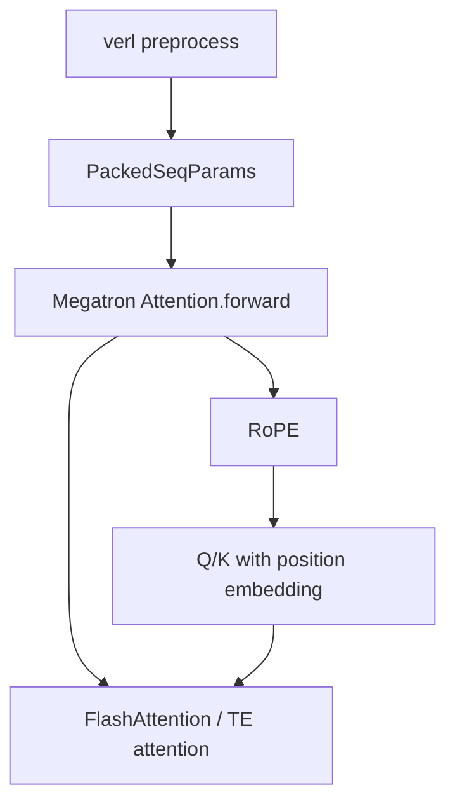

# THD cu_seqlens Bug Analysis

## 1. Executive Summary

这次问题的根因不是单个算子坏了，而是 `PackedSeqParams` 里的长度元信息语义不一致：

```text
实际参与计算的 THD tensor 长度
和
传给 RoPE / FlashAttention 的 cu_seqlens 长度
在某些 batch 下不是同一套长度
```

已经观察到三种表现：

| 报错 | 含义 | 结论 |
| --- | --- | --- |
| `tensor size = 284, split_sizes = [296]` | tensor 是未 padding 的，但 RoPE 拿到了 padded 长度 | RoPE metadata 过长 |
| `aclnnFlashAttentionVarLenScore` 异步报错 | RoPE 之后，varlen attention 也可能拿到不匹配长度 | 同类长度元信息问题 |
| `tensor size = 584, split_sizes = [284, 293]` | tensor 仍包含 padding slot，但 RoPE 拿到了真实未 padding 长度 | source-only patch 太粗，metadata 变短了 |

最终推荐的修复方向是：

```text
verl 保留两套长度：
  cu_seqlens_q/kv          = 真实长度
  cu_seqlens_q/kv_padded   = padded 长度

Megatron RoPE 在运行时根据当前 query/key tensor.size(0) 选择匹配的一套。
```

对应最终推荐 patch：

- `patches/20260528-verl-v071-preserve-real-and-padded-cu-seqlens.patch`
- `patches/20260528-megatron-3714d8-rope-select-matching-cu-seqlens.patch`

不要再使用之前的 source-only patch：

- `patches/20260528-verl-v071-source-real-thd-cu-seqlens.patch`

它会导致 `584 vs [284,293]` 这种反向错误。

## 2. Important Terms

### 2.1 THD / TND

普通 Transformer 输入常见形状是：

```text
[seq_len, batch, hidden]
```

packed sequence 场景下，会把多个样本的有效 token 拼成一条 token 流，attention 内部常用：

```text
[T, H, D]
```

含义是：

- `T`: 这一批 pack 后的总 token 数
- `H` / `N`: attention head 数
- `D`: 每个 head 的维度

Megatron 里常叫 `thd`，MindSpeed/NPU 里有时叫 `TND`，本质都是“按 token 展平后的 packed 格式”。

### 2.2 Packed Sequence

假设一个 batch 有两条样本：

```text
样本 A: 284 个有效 token
样本 B: 293 个有效 token
```

普通做法可能 pad 成同样长度；packed sequence 会把有效 token 接起来：

```text
[A 的 284 个 token][B 的 293 个 token]
```

这时 tensor 里没有天然的 batch 边界，所以需要额外 metadata 告诉 attention 每条样本从哪里开始、到哪里结束。

### 2.3 cu_seqlens

`cu_seqlens` 是 cumulative sequence lengths，中文可以理解成“累计长度表”。

如果两条样本长度是：

```text
[284, 293]
```

那么：

```text
cu_seqlens = [0, 284, 577]
```

含义是：

```text
第 0 条样本: token [0, 284)
第 1 条样本: token [284, 577)
```

Megatron RoPE 里会做类似逻辑：

```python
seqlens = cu_seqlens[1:] - cu_seqlens[:-1]
torch.split(t, seqlens)
```

所以 `seqlens.sum()` 必须等于 `t.size(0)`。如果不等，就会出现这次的 `split_with_sizes` 报错。

### 2.4 Padding / Padded Length

为了让 kernel 更高效，或者为了满足 TP/CP/FP8 对齐要求，系统会把每条样本长度向上补齐。

例如：

```text
真实长度: [284, 293]
padded 后: [288, 296]
```

那么：

```text
真实 cu_seqlens: [0, 284, 577]
padded cu_seqlens: [0, 288, 584]
```

这两套长度都可能有用，但不能混用。

### 2.5 RoPE

RoPE 是 Rotary Position Embedding，旋转位置编码。

它在 attention 之前给 query/key 加位置信息。因为 THD tensor 是 pack 后的一条长 token 流，RoPE 必须知道每条样本的长度，才能把位置编码切成每个样本对应的片段。

这就是为什么 RoPE 会调用：

```python
torch.split(t, seqlens)
```

### 2.6 CP / TP / PP / VPP / SP

这些都是并行策略：

- `TP`: Tensor Parallel，把一个层里的大矩阵/attention head 切到多张卡上。
- `PP`: Pipeline Parallel，把模型层切成多段，不同卡负责不同层。
- `VPP`: Virtual Pipeline Parallel，在 PP 的基础上把每个 stage 再切成多个虚拟 chunk。
- `CP`: Context Parallel，把长序列按 token 维度切开，让不同卡处理不同上下文片段。
- `SP`: Sequence Parallel，通常和 TP 配合，把激活在 sequence 维度切分，减少显存。

这次问题主要和 `CP + THD packed sequence + RoPE/varlen attention` 有关。

## 3. Actual Failure Flow

### 3.1 Normal Intended Flow

理想情况下，数据流应该是：



其中 `PackedSeqParams` 应该同时携带两类信息：

```text
真实长度: 用来描述有效 token
padded 长度: 用来描述 tensor 里实际保留的 padding slot / kernel 对齐位置
```

### 3.2 What Went Wrong

在 `verl release/v0.7.1` 的原始代码里，构造 `PackedSeqParams` 时是：

```python
cu_seqlens_q = cu_seqlens_padded
cu_seqlens_kv = cu_seqlens_padded
cu_seqlens_q_padded = cu_seqlens_padded
cu_seqlens_kv_padded = cu_seqlens_padded
```

也就是说，真实长度丢了，四个字段都指向 padded 长度。

而 Megatron-LM `3714d81d4` 的 RoPE 逻辑是：

```python
if packed_seq_params.cu_seqlens_q_padded is not None:
    cu_seqlens_q = packed_seq_params.cu_seqlens_q_padded
else:
    cu_seqlens_q = packed_seq_params.cu_seqlens_q
```

这会导致：只要 padded 字段存在，RoPE 就优先使用 padded 长度。

当实际 `query` tensor 是未 padding 的，就会出现：

```text
t.size(0) = 284
seqlens = [296]
```

于是：

```python
torch.split(t, [296])
```

必然失败，因为 `t` 只有 284 个 token。

## 4. Why the Intermediate Patches Failed

### 4.1 MindSpeed-only Patch

MindSpeed-only patch 尝试在 MindSpeed wrapper 里根据当前 tensor 长度重建 `cu_seqlens`。

它能解释为什么第一个 RoPE 报错消失了，但后面又出现：

```text
aclnnFlashAttentionVarLenScore
```

原因是：RoPE 只是第一个消费者。后面 varlen attention kernel 也会消费长度元信息。如果只修 RoPE，不修整个 metadata 流，后续还可能继续报错。

结论：

```text
MindSpeed-only patch 是临时绕过，不是源头修复。
```

### 4.2 Source-only Patch

source-only patch 把四个字段都改成真实长度：

```python
cu_seqlens_q = cu_seqlens
cu_seqlens_kv = cu_seqlens
cu_seqlens_q_padded = cu_seqlens
cu_seqlens_kv_padded = cu_seqlens
```

它能修：

```text
t.size(0) = 284
seqlens = [296]
```

但会引入新的反向错误：

```text
t.size(0) = 584
seqlens = [284, 293]
```

原因是这个 batch 的实际 THD tensor 仍然包含 padding slot：

```text
真实 local token 数: 284 + 293 = 577
实际 tensor local 长度: 584
差值: 7 个 local padding slot
```

这时 RoPE 应该用 padded 长度切 tensor，而不是用真实长度。

结论：

```text
不能把 padded 字段也强行改成真实长度。
```

## 5. Final Recommended Patch Review

### 5.1 verl Patch

文件：

```text
patches/20260528-verl-v071-preserve-real-and-padded-cu-seqlens.patch
```

适用：

```text
verl origin/release/v0.7.1 = fa69bc0e
```

核心改动：

```python
cu_seqlens_q = cu_seqlens
cu_seqlens_kv = cu_seqlens
cu_seqlens_q_padded = cu_seqlens_padded
cu_seqlens_kv_padded = cu_seqlens_padded
```

这个改动是正确的源头语义：

```text
普通字段 = 真实长度
padded 字段 = padded 长度
```

### 5.2 Megatron Patch

文件：

```text
patches/20260528-megatron-3714d8-rope-select-matching-cu-seqlens.patch
```

适用：

```text
Megatron-LM dev commit = 3714d81d4
```

核心改动：

```python
def _select_rope_cu_seqlens(tensor, cu_seqlens, cu_seqlens_padded):
    cp_size = self.pg_collection.cp.size()
    for candidate in (cu_seqlens, cu_seqlens_padded):
        if candidate is None:
            continue
        seqlens = (candidate[1:] - candidate[:-1]) // cp_size
        if int(seqlens.sum().item()) == tensor.size(0):
            return candidate
    return cu_seqlens_padded if cu_seqlens_padded is not None else cu_seqlens
```

它不再无脑优先使用 padded 字段，而是：

```text
如果真实长度能切当前 tensor，就用真实长度。
如果 padded 长度能切当前 tensor，就用 padded 长度。
```

这可以同时覆盖：

```text
t.size(0) = 284, seqlens candidates = [284] / [296]
t.size(0) = 584, seqlens candidates = [284,293] / padded lengths
```

### 5.3 Why Both Patches Are Needed

只改 verl：

```text
Megatron 3714d8 仍然优先用 cu_seqlens_q_padded
如果 tensor 未 padding，仍可能拿错
```

只改 Megatron：

```text
verl 原始代码里 cu_seqlens_q 和 cu_seqlens_q_padded 都是 padded
Megatron 没有真实长度可选
```

所以需要两边同时改：

```text
verl: 提供两套正确 metadata
Megatron: 根据实际 tensor 选择正确 metadata
```

## 6. Patch Status Audit

### Recommended

使用这一组：

```text
patches/20260528-verl-v071-preserve-real-and-padded-cu-seqlens.patch
patches/20260528-megatron-3714d8-rope-select-matching-cu-seqlens.patch
```

说明文档：

```text
patches/20260528-robust-thd-cu-seqlens-fix-notes.md
```

### Not Recommended

这些是排查过程中的中间版本，不建议继续使用：

```text
patches/20260528-mindspeed-single-seq-rope-cu-seqlens.patch
patches/20260528-verl-v071-source-real-thd-cu-seqlens.patch
patches/20260528-verl-source-real-thd-cu-seqlens.patch
```

原因：

- MindSpeed-only patch 只是在 wrapper 层补救，容易漏掉其他消费者。
- source-only patch 把 padded 字段也改成真实长度，会触发 `584 vs [284,293]` 这种反向错误。
- `verl-source-real-thd-cu-seqlens.patch` 是基于 `main` 生成，不适合 `release/v0.7.1`。

## 7. Apply Instructions

先确保不要叠加中间 patch。推荐从干净工作区开始。

### 7.1 Apply verl Patch

```bash
cd /path/to/verl
git checkout release/v0.7.1
git apply /path/to/blue_to_yellow/patches/20260528-verl-v071-preserve-real-and-padded-cu-seqlens.patch
```

检查结果应该类似：

```python
cu_seqlens_q=cu_seqlens
cu_seqlens_kv=cu_seqlens
cu_seqlens_q_padded=cu_seqlens_padded
cu_seqlens_kv_padded=cu_seqlens_padded
```

### 7.2 Apply Megatron Patch

```bash
cd /path/to/Megatron-LM
git checkout 3714d81d418c9f1bca4594fc35f9e8289f652862
git apply /path/to/blue_to_yellow/patches/20260528-megatron-3714d8-rope-select-matching-cu-seqlens.patch
```

检查结果应该看到 `_select_rope_cu_seqlens`。

## 8. Validation Plan

### 8.1 Basic Static Check

```bash
cd /path/to/verl
python -m py_compile verl/models/mcore/util.py

cd /path/to/Megatron-LM
python -m py_compile megatron/core/transformer/attention.py
```

### 8.2 Runtime Check

先跑之前能复现的配置。

如果仍出现 NPU 异步报错，临时打开同步模式拿准确栈：

```bash
export ASCEND_LAUNCH_BLOCKING=1
```

复现后记得关闭：

```bash
unset ASCEND_LAUNCH_BLOCKING
```

### 8.3 What to Look For

如果仍报 `split_with_sizes`，重点看：

```text
t.size(0)
split_sizes
split_sizes sum
```

判断规则：

```text
sum(split_sizes) < t.size(0): RoPE 选短了，可能该选 padded。
sum(split_sizes) > t.size(0): RoPE 选长了，可能该选 real。
```

如果报 `FlashAttentionVarLenScore`，重点看 attention kernel 使用的是：

```text
cu_seqlens_q/kv
还是
cu_seqlens_q/kv_padded
```

这说明后续 consumer 也需要类似的选择策略。

## 9. Remaining Risks

### 9.1 Megatron Patch Has a Small Synchronization Cost

`_select_rope_cu_seqlens` 里使用了：

```python
int(seqlens.sum().item())
```

这会产生一次 device-to-host 同步。作为验证 patch 可以接受；如果要合入生产版本，可以考虑把长度选择提前到 CPU metadata 构造阶段，或者在框架层维护明确的 local token count。

### 9.2 Attention Kernel May Need Similar Consumer-specific Logic

最终 robust patch 明确修了 RoPE 的选择逻辑。attention kernel 是否完全正确，取决于具体后端是否正确使用 real/padded 两套字段。

如果后续继续出现 `FlashAttentionVarLenScore` 的长度类错误，方向不是回退 RoPE patch，而是给 attention kernel 也加类似原则：

```text
哪个长度能描述当前传入 kernel 的 tensor，就用哪个长度。
```

### 9.3 Multi-sequence + CP Is the Hard Case

单序列时，长度可以从 `t.size(0)` 反推；多序列时不行。

例如：

```text
t.size(0) = 584
真实长度 [284, 293] sum = 577
```

仅看 `584` 不能知道每条样本 padded 后分别是多少。因此必须保留 `cu_seqlens_padded`，不能只保留真实长度。

## 10. Final Recommendation

当前最合理的验证路径是：

```text
1. 回退所有中间 patch
2. 应用 verl preserve-real-and-padded patch
3. 应用 Megatron RoPE select-matching patch
4. 用原复现配置测试
```

如果这组 patch 跑通，说明根因基本坐实：

```text
verl/Megatron/MindSpeed 对 PackedSeqParams 里 real/padded cu_seqlens 的消费语义不一致。
```

正式修复应该遵循同一个原则：

```text
metadata 源头保留真实长度和 padded 长度；
每个 consumer 明确选择自己需要的那一套，而不是固定优先使用某个字段。
```
