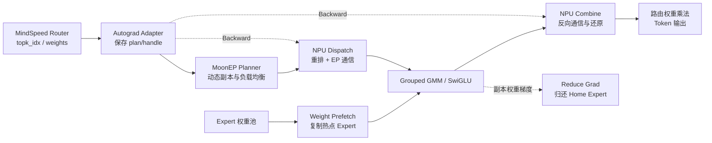

# Ascend DeepEP 与 MoonEP 的 NPU 训练迁移调研

> 日期：2026-07-28
>
> 阶段：方案调研，尚未进入算子实现
>
> 最终实现仓：`ascend_deepep`
>
> 本地审计版本：`ascend_deepep@f7904e4db2eb3bc78c32b53d3e11590b22653395`
>
> MoonEP 审计版本：`MoonshotAI/MoonEP@0f385f038fc33bec22e3bcf5a07a8a22693e754c`

## 1. 结论摘要

后续应把自有的 `ascend_deepep` 作为唯一实现仓。`sgl-kernel-npu` 只用于核对 NPU 前向算子的规格、调用栈和实现思路，不再作为最终依赖或代码归属。

当前 `ascend_deepep` 的成熟度比 README 描述得低：

- 已经搭好了 SHMEM、PyTorch 扩展、编译体系和算子调用框架；
- 已经有一个真正实现的 `allgather_matmul` 通算融合样例；
- `dispatch`、`combine` 的 C++ 接口外壳已经存在；
- 但是两个核心 device kernel 当前仍是空实现；
- 没有训练反向、Autograd、MoonEP planner、权重预取和副本梯度归并。

因此，当前任务不是“只补反向”，而应重新表述为：

> 先在 `ascend_deepep` 中实现一个训练可用的基础 DeepEP：正向 Dispatch/Combine、反向、BF16 和异步执行；再在此基础上逐步增加 MoonEP 的动态冗余专家、完美负载均衡和权重预取。

本次仅进行源码审计。由于本地第三方子模块尚未初始化，且当前没有执行 NPU 多卡任务，因此文中的“已实现”表示源码中存在有效实现，并不等价于已经在本环境完成运行验证。

## 2. `ascend_deepep` 当前实现情况

### 2.1 已有基础设施

| 模块 | 当前状态 | 作用 | 源码依据 |
|---|---|---|---|
| SHMEM 初始化与销毁 | 已有 | 建立 NPU rank 之间可互相访问的对称内存 | `csrc/shmem_instance.cpp` |
| PyTorch C++ 扩展 | 已有 | 允许 Python 通过 `torch.classes` 调用 C++ | `csrc/torch_classes.cpp` |
| 对称 workspace | 已有 | 给通信算子分配各 rank 地址一致的缓冲区 | `csrc/torch_classes.cpp` |
| Dispatch/Combine 接口外壳 | 已有 | 参数检查、输出张量分配、kernel launcher | `csrc/ops/dispatch.cpp`、`combine.cpp` |
| AllGatherMatmul | 有真实 kernel | 已存在的通信与矩阵乘法融合样例 | `kernels/allgather_matmul.cpp` |
| Dispatch device kernel | 空实现 | 尚未搬运 token | `kernels/dispatch.cpp` |
| Combine device kernel | 空实现 | 尚未把 expert 输出送回原 token | `kernels/combine.cpp` |
| Autograd/反向 | 没有 | 没有 `torch.autograd.Function` 或 backward API | 全仓检索结果 |
| MoonEP 动态副本 | 没有 | 没有 planner、prefetch、reduce-grad | 全仓检索结果 |

当前 Python 包实际只导出：

- `ShmemInstance`
- `Dispatch`
- `Combine`
- `AllGatherMatmul`

对应源码为 `ascend_deepep/__init__.py:29`。

README 仍然描述了当前源码树中已经不存在的 `ElasticBuffer` 和 `buffer.py`，因此 README 与当前实现存在版本漂移，不能只根据 README 判断完成度。

### 2.2 Dispatch/Combine 目前只是调用外壳

Dispatch 的 C++ 包装层已经规定了初步接口：

- `x`：`[num_tokens, hidden]`，当前只接受 FP16；
- `topk_idx`：`[num_tokens, topk]`，INT32；
- `topk_weights`：可选，FP32；
- `num_experts`；
- `num_max_tokens_per_rank`；
- 输出包括 `recv_x`、接收侧路由信息和 `[T, K, 4]` 的 handle。

依据：`csrc/ops/dispatch.cpp:28`。

但是，`kernels/dispatch.cpp:11` 和 `kernels/combine.cpp:9` 明确写着“当前为空实现，仅作为调用实例”。当前测试 `test/test_dispatch.py` 也只验证调用链；Combine 调用和正确性断言仍被注释。

另外，当前分配的 `handle[T, K, 4]` 会被初始化为 `-1`，但因为 kernel 为空，它没有被填入真实的源 rank、目标 rank、slot 等信息。因此，现阶段不能把这个 handle 当成已经冻结的训练 ABI。

### 2.3 AllGatherMatmul 的价值

`allgather_matmul` 已经使用 CatCCOS/CATLASS 实现了通信与矩阵乘法融合，并且测试中存在数值正确性检查：

- kernel：`kernels/allgather_matmul.cpp`；
- 测试：`test/test_allgather_matmul.py`。

它不能直接充当 EP Dispatch，但证明了仓库已经具备以下工程链路：

```text
PyTorch
  → C++ Extension
  → 当前 NPU stream
  → CatCCOS 通信
  → CATLASS 计算
  → 异步 kernel launch
```

因此，它可以作为后续实现“EP 通信与 GMM overlap”的工程参考。

## 3. 正向算子能否复用来实现反向

结论是：

> 隐藏状态的通信部分可以由 Dispatch 和 Combine 互相复用，但完整的 MoE 反向不能只调用这两个正向算子。

### 3.1 Dispatch 的反向

正向 Dispatch：

```text
原 token 顺序 X
    → 按目标 expert 重排和通信
    → expert 顺序 X_dispatch
```

对应的隐藏状态反向：

```text
dX_dispatch
    → 按正向记录反向搬运
    → dX
```

因此可以写成：

```text
dispatch_backward ≈ unweighted_combine(dX_dispatch, saved_plan)
```

这里必须保存正向的 plan/handle，否则反向不知道每份梯度原来属于哪个 token。

### 3.2 Combine 的反向

正向 Combine：

```text
expert 输出
    → 按 token 原始位置送回
    → token 输出
```

Expert 输出的隐藏状态梯度需要再次向 Expert 侧发送，因此：

```text
combine_backward 的通信部分 ≈ dispatch(dY, saved_plan)
```

### 3.3 为什么这还不是完整反向

假设最终 MoE 输出为：

\[
Y_t=\sum_{k=1}^{K}p_{t,k}Z_{t,k}
\]

其中：

- \(Z_{t,k}\) 是第 \(k\) 个 Expert 对 token \(t\) 的输出；
- \(p_{t,k}\) 是 Router 给该 Expert 的权重。

反向需要：

\[
dZ_{t,k}=p_{t,k}\cdot dY_t
\]

同时还需要：

\[
dp_{t,k}=\langle dY_t,Z_{t,k}\rangle
\]

Dispatch/Combine 只能完成 `dY`、`dZ` 的通信和重排，不能凭空计算 Router 权重梯度 `dp`。`dp` 的计算需要保存 Expert 输出，或者在 backward 中重算 Expert 输出。

### 3.4 推荐的接口边界

建议把 `ascend_deepep` 的底层算子定义成无权重通信原语：

```python
dispatched_x, plan = dispatch(x, topk_idx, ...)
token_output = combine(expert_output, plan, ...)
```

路由权重乘法单独处理：

```python
weighted_output = sum(route_weight * expert_output)
```

这样做有几个好处：

- Dispatch/Combine 的反向关系清楚；
- 通信算子不承担 Router 数学；
- MindSpeed 可以自行决定把权重乘法放在 GMM epilogue、框架层还是单独 kernel；
- 后续接入 MoonEP 时接口也更一致。

MoonEP 的 Combine 会汇聚 hidden 和 route weights，但不会在通信内部完成最终的路由权重乘法，详见 [MoonEP API 源码][moonep-api]。

## 4. MoonEP 不只是另一个 DeepEP

更准确的关系是：

- DeepEP：在 Expert 位置固定的前提下，优化 token 的 Dispatch/Combine；
- MoonEP：保留类似的通信流程，同时增加在线负载规划和动态 Expert 副本，让每个 rank 收到相同数量的 token。

MoonEP 不是直接依赖 DeepEP 的封装，而是一套独立实现。

### 4.1 MoonEP 的负载均衡思路

传统 EP 中，如果大量 token 同时选中某个 Expert：

```text
Rank 0：收到 1000 个 token
Rank 1：收到  200 个 token
Rank 2：收到  150 个 token
Rank 3：收到  180 个 token
```

所有 rank 最终都需要等待最慢的 Rank 0。

MoonEP 根据当前 microbatch 的路由结果，动态复制热点 Expert：

```text
热点 Expert 17
    → 原副本位于 Rank 0
    → 临时副本放到 Rank 1、Rank 2
    → token 在三个副本之间重新分配
```

MoonEP 的目标是让每个 rank 恰好接收 `S × K` 个 expert-token，其中：

- `S`：每个 rank 的本地 token 数；
- `K`：每个 token 选择的 Expert 数。

### 4.2 MoonEP 需要迁移的功能模块

| 模块 | 作用 | NPU 侧工作 |
|---|---|---|
| Online planner | 根据本轮路由决定复制哪些 Expert | CUDA planner 不能直接复用，需要 NPU 实现 |
| Dispatch | 按规划后的物理 Expert 发送 token | 需要实现 |
| Prefetch | 把临时副本的 Expert 权重搬到本 rank | 需要实现 |
| Combine | 将结果送回 token 所属 rank | 需要实现 |
| Reduce-grad | 把副本产生的权重梯度归还原 Expert | 需要实现 |
| Static buffer | 固定每个 rank 的接收数量 | 需要重新设计 NPU buffer |
| Zero-copy permute | 避免额外 token 重排拷贝 | 需要按照 NPU 内存模型重做 |

主要依据：

- [MoonEP README][moonep-readme]
- [planning.py][moonep-planning]
- [prefetch.py][moonep-prefetch]
- [grad_reduce.py][moonep-grad-reduce]

Kimi K3 技术报告第 19～20 页还描述了：

- 规划下一层的 Expert 副本；
- 提前预取副本权重；
- backward 将副本梯度聚合回 home Expert；
- Dispatch 重算以减少保存激活；
- Dispatch 与 grouped GEMM backward overlap；
- shared Expert 使用独立 stream。

但是，workload-aware GMM 调度、shared-Expert stream 和完整训练流水线属于 K3 的完整训练系统，不一定全部包含在公开 MoonEP 仓库中，不能把技术报告中的全部系统能力等同于当前开源代码。

## 5. 建议的统一架构



建议按四层划分代码边界：

1. `runtime`

   SHMEM、对称内存、rank/world、stream、event 和 buffer slot 生命周期。

2. `transport`

   基础的无权重 Dispatch/Combine，以及 layout、plan、handle。

3. `moon`

   Planner、动态 Expert 副本、Prefetch、Reduce-grad 和 Static buffer。

4. `mindspeed_adapter`

   `torch.autograd.Function`、Router 权重梯度、GMM、重计算和 overlap。

基础 DeepEP 兼容层和 MoonEP 算法层不应在第一版就绑成一个巨型 kernel。

## 6. 分阶段实施建议

| 阶段 | 工作内容 | 验收标准 |
|---|---|---|
| P0：冻结接口 | 定义 tensor shape、dtype、plan/handle、是否带权重 | Python reference 和接口文档完成 |
| P1：基础前向 | 真正实现 BF16 Dispatch/Combine | 与 `torch.distributed` 参考结果一致 |
| P2：训练反向 | Autograd；Dispatch bwd→Combine；Combine bwd→Dispatch；route-weight grad | 前向和梯度均与 PyTorch reference 一致 |
| P3：异步与 overlap | 通信 stream、event、多 buffer slot、生命周期管理 | 无隐式同步，能够与 GMM overlap |
| P4：MoonEP Planner | 在线规划、固定 `S*K`、动态副本映射 | 任意偏斜路由下各 rank 负载相同 |
| P5：副本训练 | 权重预取和 FP32 Reduce-grad | 副本梯度与无副本基线一致 |
| P6：高级优化 | Zero-copy、Dispatch 重算、GMM 调度 | 显存和性能达到目标 |
| P7：多机 | 跨节点通信策略 | 根据实际预训练集群决定 |

当前最应该完成的是 P0～P2。没有基础正向和正确反向，过早做 Planner 或 overlap 会让错误难以定位。

### 6.1 正确性测试至少需要覆盖

- balanced、随机偏斜、所有 token 命中同一 Expert；
- 某些 Expert 收到 0 个 token；
- TopK 为 6、8、16；
- BF16 hidden、FP32 route weight、INT32 index；
- Dispatch → identity Expert → Combine 的端到端结果；
- Expert 输出梯度和 Router 权重梯度；
- 与 PyTorch reference 对比梯度，而不仅是验证“不崩溃”；
- 正向 plan 在 backward 中复用；
- 单 stream 正确后再验证异步 stream。

## 7. 首批模型需要保证的配置

不能只看 Transformer 的 `hidden_size`。真正决定 EP kernel 规格的是：

- EP 实际通信的 hidden 维度；
- Expert 中间维度；
- Expert 数量；
- TopK；
- dtype；
- 每 rank token 数 `S`；
- EP size。

### 7.1 第一版模型矩阵

| 模型 | EP 通信 H | Expert H′ | Expert 数 E | TopK | 基础 dtype | 配置来源 |
|---|---:|---:|---:|---:|---|---|
| Kimi K3 | 3584 | 3072 | 896 | 16 | BF16 | [Kimi K3 config][kimi-k3-config]、[K3 技术报告][kimi-k3-report] |
| DeepSeek-V3 | 7168 | 2048 | 256 | 8 | BF16 | [DeepSeek-V3 config][dsv3-config] |
| DeepSeek-V4 Flash Base | 4096 | 2048 | 256 | 6 | BF16；Expert 配置含 FP8 | [DSV4 Flash Base config][dsv4-flash-config] |
| DeepSeek-V4 Pro Base | 7168 | 3072 | 384 | 6 | BF16；Expert 配置含 FP8 | [DSV4 Pro Base config][dsv4-pro-config] |
| GLM-5.2 | 6144 | 2048 | 256 | 8 | BF16；Router FP32 | [GLM-5.2 config][glm52-config] |

K3 的 Transformer 主 hidden size 是 7168，但 Stable LatentMoE 会先将 hidden 投影到 3584，再在这个 latent 空间执行 routed Expert 通信。因此，对 K3 的 EP kernel 而言，最关键的通信 `H` 是 3584，而不是 7168。

### 7.2 第一版 dtype 范围

| 数据 | 建议 dtype |
|---|---|
| Dispatch/Combine hidden | BF16 必须支持 |
| Router score/route weight | FP32 |
| TopK index | INT32 |
| token count/offset | INT32，容量确认后再考虑 INT64 |
| Combine 累加 | FP32 |
| 最终输出 | BF16 |
| Expert 权重 | 第一阶段 BF16 |
| 副本梯度/Reduce buffer | FP32 |
| FP8/FP4 Expert | 后续独立阶段 |

当前 `ascend_deepep` 的 Dispatch/Combine 只接受 FP16，与目标模型的训练基线不匹配。因此 BF16 应当是第一个实现优先级，而不是扩展项。

K3 发布 checkpoint 中能看到 MXFP4 配置，但技术报告说明 MXFP4/MXFP8 是后训练 QAT 阶段使用的方案，不能据此推断 K3 初始预训练的 EP 通信也使用 FP4。

### 7.3 EP size 不是模型固定参数

模型配置只能确定 Expert 数 `E`，不能确定实际预训练使用的 EP size。基本约束是：

\[
E \bmod EP = 0
\]

为了让同一版 kernel 覆盖上述模型，可以先验证：

```text
EP = 8、16、32
```

这三个值都能整除 `E = 256、384、896`。但它们只是公共验证集合，不代表 K3 的真实预训练 EP 配置。

| Expert 数 | EP=8 每 rank Expert | EP=16 | EP=32 |
|---:|---:|---:|---:|
| 256 | 32 | 16 | 8 |
| 384 | 48 | 24 | 12 |
| 896 | 112 | 56 | 28 |

EP size 对 MoonEP 尤其重要，因为训练模式默认最多准备 `B=E/EP` 个冗余 Expert slot。K3 若使用 EP=8，每 rank 的副本池上限是 112 个 Expert；若使用 EP=32，则为 28 个。该数值会直接决定：

- 权重预取 buffer；
- FP32 grad-reduce buffer；
- SHMEM workspace；
- 通信量；
- 是否能放入 HBM。

### 7.4 `S` 不是模型最大上下文长度

MoonEP 中的 `S` 是当前 rank、当前 microbatch 真正参与 MoE 的 token 数，大致为：

\[
S \approx
\frac{\text{micro batch size}\times\text{sequence length}}
{\text{context parallel size}}
\]

实际还会受到 sequence parallel、padding、packed sequence 等因素影响。

因此，不能直接使用模型的 `max_position_embeddings` 分配 EP buffer。还需要从实际 MindSpeed 预训练脚本确认：

- micro batch size；
- sequence length；
- CP/SP/TP；
- 每一层是否都是 MoE；
- token 数是否固定；
- 是否需要多个 `S` bucket。

## 8. 需要与领导对齐的问题

1. 第一阶段目标是“DeepEP 兼容 API”，还是直接实现完整 MoonEP API？

   建议先完成基础无权重 Dispatch/Combine，再扩展 MoonEP。

2. 训练侧是否接受路由权重在框架层或 GMM epilogue 中计算？

   建议接受，否则 Combine backward 还需要承担 Router weight gradient，接口会复杂很多。

3. K3 的实际预训练配置是什么？

   公开资料没有给出真实 EP size、microbatch、CP 和每 rank 的 `S`，需要内部训练配置。

4. 第一阶段运行平台是 A2/910B，还是 A5/Ascend 950？

   该选择会影响 SHMEM、kernel 和通信能力边界。

5. 第一阶段是否只要求单机？

   MoonEP 开源实现主要面向 NVLink 单节点；多机 RDMA/HCCL 属于额外设计，不能直接翻译 CUDA 代码获得。

6. 第一阶段模型优先级是否为：

   ```text
   Kimi K3 → DeepSeek-V3/GLM-5.2 → DeepSeek-V4 Flash/Pro
   ```

7. 是否要求第一阶段就支持 Zero-copy 和固定 shape？

   建议先完成基础正确性和反向，再实现这些性能优化。

## 9. 建议的组会汇报表述

> 已确认后续以自有 `ascend_deepep` 仓为实现主体。当前仓库已经具备 SHMEM、PyTorch 扩展、NPU kernel launcher 和一个可参考的 AllGatherMatmul 通算融合样例，但 Dispatch/Combine 的 device kernel 仍是空实现，测试也没有覆盖数值正确性。因此任务不是单纯补反向，而是需要从基础正向通信开始补齐。
>
> 训练反向中，Dispatch 和 Combine 的隐藏状态通信可以互为反向算子，但 Router 权重梯度不能直接复用通信算子，需要框架层额外计算；如果引入 MoonEP 动态 Expert 副本，还必须实现权重预取和副本梯度 Reduce。
>
> 建议分阶段实现：基础 BF16 Dispatch/Combine → Autograd 与反向正确性 → 异步 overlap → MoonEP Planner/动态副本 → Prefetch/Reduce-grad → Zero-copy 与调度优化。首批覆盖 K3、DSV3、DSV4、GLM-5.2，对应重点规格为 H={3584,4096,6144,7168}、TopK={6,8,16}、E={256,384,896}、BF16 hidden/FP32 Router/INT32 index，并优先验证公共 EP={8,16,32}。实际 EP size 和每 rank token 数仍需从内部预训练配置确认。

## 10. 参考资料

### 10.1 本地 `ascend_deepep` 源码

本地审计 commit：`f7904e4db2eb3bc78c32b53d3e11590b22653395`

- `README.md`
- `.gitmodules`
- `ascend_deepep/__init__.py`
- `csrc/shmem_instance.cpp`
- `csrc/torch_classes.cpp`
- `csrc/ops/dispatch.cpp`
- `csrc/ops/combine.cpp`
- `kernels/dispatch.cpp`
- `kernels/combine.cpp`
- `kernels/allgather_matmul.cpp`
- `test/test_dispatch.py`
- `test/test_allgather_matmul.py`

### 10.2 MoonEP 与 Kimi K3

- [MoonEP 仓库][moonep-repo]
- [MoonEP README][moonep-readme]
- [MoonEP API][moonep-api]
- [MoonEP planning.py][moonep-planning]
- [MoonEP dispatch.py][moonep-dispatch]
- [MoonEP combine.py][moonep-combine]
- [MoonEP prefetch.py][moonep-prefetch]
- [MoonEP grad_reduce.py][moonep-grad-reduce]
- [MoonEP 端到端测试][moonep-e2e]
- [Kimi K3 技术报告][kimi-k3-report]
- [Kimi K3 官方仓库][kimi-k3-repo]

### 10.3 模型配置

- [Kimi K3 config][kimi-k3-config]
- [DeepSeek-V3 config][dsv3-config]
- [DeepSeek-V4 Flash Base config][dsv4-flash-config]
- [DeepSeek-V4 Pro Base config][dsv4-pro-config]
- [DeepSeek-V4 Transformers 文档][dsv4-doc]
- [GLM-5.2 config][glm52-config]

[moonep-repo]: https://github.com/MoonshotAI/MoonEP
[moonep-readme]: https://github.com/MoonshotAI/MoonEP/blob/0f385f038fc33bec22e3bcf5a07a8a22693e754c/README.md
[moonep-api]: https://github.com/MoonshotAI/MoonEP/blob/0f385f038fc33bec22e3bcf5a07a8a22693e754c/moonep/api.py
[moonep-planning]: https://github.com/MoonshotAI/MoonEP/blob/0f385f038fc33bec22e3bcf5a07a8a22693e754c/moonep/planning.py
[moonep-dispatch]: https://github.com/MoonshotAI/MoonEP/blob/0f385f038fc33bec22e3bcf5a07a8a22693e754c/moonep/dispatch.py
[moonep-combine]: https://github.com/MoonshotAI/MoonEP/blob/0f385f038fc33bec22e3bcf5a07a8a22693e754c/moonep/combine.py
[moonep-prefetch]: https://github.com/MoonshotAI/MoonEP/blob/0f385f038fc33bec22e3bcf5a07a8a22693e754c/moonep/prefetch.py
[moonep-grad-reduce]: https://github.com/MoonshotAI/MoonEP/blob/0f385f038fc33bec22e3bcf5a07a8a22693e754c/moonep/grad_reduce.py
[moonep-e2e]: https://github.com/MoonshotAI/MoonEP/blob/0f385f038fc33bec22e3bcf5a07a8a22693e754c/tests/test_e2e.py
[kimi-k3-repo]: https://github.com/MoonshotAI/Kimi-K3
[kimi-k3-report]: https://github.com/MoonshotAI/Kimi-K3/blob/main/k3_tech_report.pdf
[kimi-k3-config]: https://huggingface.co/moonshotai/Kimi-K3/blob/main/config.json
[dsv3-config]: https://huggingface.co/deepseek-ai/DeepSeek-V3/blob/main/config.json
[dsv4-flash-config]: https://huggingface.co/deepseek-ai/DeepSeek-V4-Flash-Base/blob/main/config.json
[dsv4-pro-config]: https://huggingface.co/deepseek-ai/DeepSeek-V4-Pro-Base/blob/main/config.json
[dsv4-doc]: https://huggingface.co/docs/transformers/model_doc/deepseek_v4
[glm52-config]: https://huggingface.co/zai-org/GLM-5.2/blob/main/config.json
