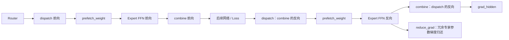
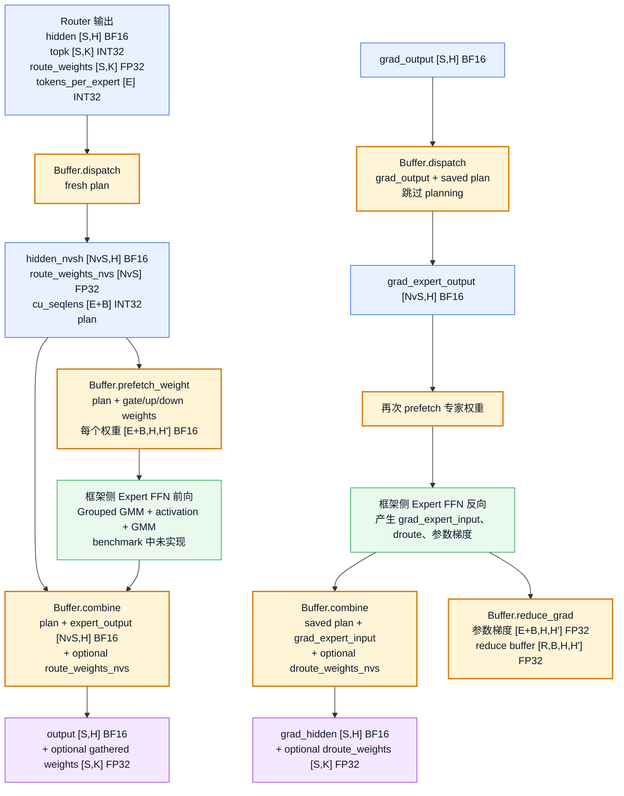

# MoonEP `bench_vs_deepep.py` 框架侧 API 调用流程解读

> 调研对象：MoonEP `master`，commit `0f385f038fc33bec22e3bcf5a07a8a22693e754c`<br>
> 核心文件：[`benchmarks/bench_vs_deepep.py`](https://github.com/MoonshotAI/MoonEP/blob/0f385f038fc33bec22e3bcf5a07a8a22693e754c/benchmarks/bench_vs_deepep.py)

## 1. 结论先行

`bench_vs_deepep.py` 不是完整的训练框架适配代码，而是一个**按照训练数据流封装 MoonEP/DeepEP API 的通信性能 benchmark**。

它适合回答：

- Router 后，框架按什么顺序调用 `dispatch`、`prefetch_weight` 和 `combine`；
- 反向如何复用正向的 `dispatch` 和 `combine`；
- `plan` 在前向、反向之间如何复用；
- MoonEP 和 DeepEP v2 的调用方式有什么差异。

它没有实现真正的 Router、Expert FFN、autograd 和优化器，因此其中的 hidden、route weight 只是用于模拟真实 shape、dtype 和通信量。

## 2. 整体流程图

### 2.1 简版总览



一句话记忆：

```text
dispatch 的反向复用 combine；
combine 的反向复用 dispatch。
```

### 2.2 关键 API 输入输出



图中黄色节点是 MoonEP API，绿色节点是训练框架负责的专家计算。MoonEP 本身不实现 Expert GMM、激活函数或者 autograd。

## 3. benchmark 使用的数据

每个 EP rank 构造：

| 数据 | Shape | dtype | 含义 |
|---|---:|---|---|
| `hidden` | `[S,H]` | BF16 | 当前 rank 的输入 token |
| `topk` | `[S,K]` | INT32 | 每个 token 选择的 K 个专家 |
| `weights` | `[S,K]` | FP32 | Router 给每条路由的权重 |
| `tpe` | `[E]` | INT32 | 当前 rank 路由到每个专家的 token 数 |
| `full_*_weight` | `[E+B,H,H']` | BF16 | gate、up、down 三套专家权重 |

默认 benchmark 配置：

```text
EP rank 数 R = 8
每 rank token 数 S = 8192
专家数 E = 384
Hidden size H = 7168
TopK K = 8
专家中间维 H' = 2048
通信使用 SM 数 = 32
```

训练场景要求 `B = E / R`。其中 `[0,E)` 是专家原始权重，`[E,E+B)` 是为动态冗余专家准备的预取槽位。

## 4. `MoonEPRunner` 的生命周期

benchmark 的整体执行顺序是：

```text
创建 Buffer，一次分配通信内存
    ↓
为当前负载不均衡度生成 routing、hidden 和 route weights
    ↓
runner.prepare()：预先生成 plan，准备计时输入
    ↓
分别计时 dispatch_fwd / dispatch_bwd / combine_fwd / combine_bwd
    ↓
单独计时 planning 和 prefetch
    ↓
切换下一组 routing，复用同一个 Buffer
    ↓
buffer.destroy()
```

### 4.1 `prepare()` 不是训练步骤

`prepare()` 首先做一次不计时的完整 dispatch：

```python
_, _, _, self.plan = self.buffer.dispatch(
    hidden, weights, topk, tpe, zero_copy=True
)
```

它的目的是提前得到：

- 后面反向调用要复用的 `plan`；
- MoonEP 通信 buffer 的本地 view；
- benchmark 统计和计时所需的数据。

真实训练中不会为了准备 benchmark 而额外 dispatch 一次。真实框架应直接保存正常前向 dispatch 返回的 `plan`。

## 5. MoonEP 正向调用

### 5.1 `dispatch_fwd()`

benchmark 代码：

```python
_, _, _, self.plan = self.buffer.dispatch(
    self.hidden,
    self.weights,
    self.topk,
    self.tpe,
    zero_copy=True,
)
self._prefetch()
```

框架实际应接收完整返回值：

```python
hidden_nvsh, route_weights_nvs, cu_seqlens, plan = buffer.dispatch(
    hidden_sh,             # [S,H] BF16
    route_weights_sk,      # [S,K] FP32
    topk_experts_sk,       # [S,K] INT32
    tokens_per_expert,     # [E] INT32
)
```

`dispatch` 内部依次完成：

```text
inter-rank sync
    → planning
    → dispatch
    → dispatch_epilogue（重复 token 的本地展开）
```

返回值：

- `hidden_nvsh [NvS,H] BF16`：完成 EP 通信、按专家分组的 token；
- `route_weights_nvs [NvS] FP32`：随 token 一起重排的路由权重；
- `cu_seqlens [E+B] INT32`：每个本地或预取专家对应的 token 区间；
- `plan`：本次通信计划，必须保存给 prefetch、combine 和两个反向过程。

### 5.2 `prefetch_weight()`

`prefetch_weight` 不在 `dispatch` 内部，框架需要显式调用：

```python
buffer.prefetch_weight(
    plan=plan,
    full_gate_weight=full_gate_weight,
    full_up_weight=full_up_weight,
    full_down_weight=full_down_weight,
)
```

它根据 `plan.experts_to_copy`，把当前 rank 需要使用的远端专家权重搬入 `[E,E+B)` 预取槽位。

因此，框架侧必须保证：

```text
dispatch 完成
    → prefetch_weight 完成
    → Expert FFN 才能安全读取专家权重
```

### 5.3 Expert FFN

benchmark 没有运行真正的 Expert FFN。真实框架需要在这里执行：

```text
Grouped GMM
    → 激活函数
    → Grouped GMM
```

输入通常包括：

- `hidden_nvsh [NvS,H]`；
- `cu_seqlens [E+B]`；
- `[E+B,H,H']` 布局的专家权重；
- `route_weights_nvs [NvS]`，具体由框架决定在哪一步乘权重。

MoonEP `combine` 只对 hidden 做 K 路累加，不负责乘 Router 权重。为了得到带 Router 权重的 MoE 输出，框架必须在 combine 之前或外部逻辑中完成权重处理。

### 5.4 `combine_fwd()`

benchmark 代码：

```python
self.buffer.combine(
    plan=self.plan,
    hidden_nvsh=self.shard_view,
    zero_copy=True,
)
```

真实框架调用：

```python
output_sh, gathered_weights, event = buffer.combine(
    plan=plan,
    hidden_nvsh=expert_output_nvsh,       # [NvS,H] BF16
    route_weights_nvs=route_weights_nvs,  # [NvS] FP32，可选
)
```

`combine` 内部依次完成：

```text
可选：把用户 tensor copy 到通信 buffer
    → combine_prologue（同一 rank 上的重复结果先局部归并）
    → combine（跨 rank 拉取 primary output 并完成最终 K 路累加）
```

返回：

- `output_sh [S,H] BF16`；
- 可选的 `gathered_weights [S,K] FP32`；
- 异步模式下的 CUDA event。

## 6. MoonEP 反向调用

### 6.1 combine 的反向：复用 `dispatch`

前向 combine 的数据方向是：

```text
专家顺序 [NvS,H] → token 顺序 [S,H]
```

它的反向需要把 `grad_output [S,H]` 重新发送到对应专家，因此复用 dispatch：

```python
grad_expert_output_nvsh, _, _, _ = buffer.dispatch(
    grad_output_sh,
    plan=saved_plan,
)
```

传入保存的 `plan` 后：

- 跳过 planning；
- 不再传 `topk_experts_sk` 和 `tokens_per_expert`；
- 梯度严格复用前向的路由关系。

benchmark 的 `dispatch_bwd()` 随后又调用一次 `prefetch_weight()`。不是因为 saved-plan dispatch 本身需要权重，而是后面的 Expert FFN 反向需要读取前向专家权重。

### 6.2 Expert FFN 反向

框架在这里计算：

```text
grad_expert_output
    → Expert FFN backward
    → grad_expert_input
    → route weight 梯度
    → expert 参数梯度
```

benchmark 不进行真实梯度计算，因此使用已有 tensor 模拟对应 shape 和通信量。

### 6.3 dispatch 的反向：复用 `combine`

前向 dispatch 的数据方向是：

```text
token 顺序 [S,H] → 专家顺序 [NvS,H]
```

它的反向要将专家输入梯度送回原 token，因此复用 combine：

```python
grad_hidden_sh, droute_weights_sk, _ = buffer.combine(
    plan=saved_plan,
    hidden_nvsh=grad_expert_input_nvsh,
    route_weights_nvs=droute_weights_nvs,  # 可选
)
```

返回：

- `grad_hidden_sh [S,H] BF16`；
- 可选的 `droute_weights_sk [S,K] FP32`。

benchmark 的 `combine_bwd()` 使用 `self.weights_view` 模拟 `droute_weights_nvs` 的搬运，但这些数值不是真正由 autograd 计算出来的梯度。

### 6.4 `reduce_grad()`

动态预取的专家会在其他 rank 的 `[E,E+B)` 槽位产生临时参数梯度。框架需要调用：

```python
buffer.reduce_grad(
    plan=plan,
    full_gate_grad=full_gate_grad,
    full_up_grad=full_up_grad,
    full_down_grad=full_down_grad,
    gate_reduce_buffer=gate_reduce_buffer,
    up_reduce_buffer=up_reduce_buffer,
    down_reduce_buffer=down_reduce_buffer,
)
```

它把冗余专家的参数梯度累加回专家 owner rank。

benchmark 没有计入 `reduce_grad`，因为作者把它视为可以和后续计算重叠、并且不在 MoE 关键路径上的操作。

## 7. benchmark 方法名与 autograd 含义

| benchmark 方法 | 实际 API | autograd 含义 |
|---|---|---|
| `dispatch_fwd()` | fresh `dispatch` + `prefetch_weight` | dispatch 前向 |
| `combine_fwd()` | `combine` | combine 前向 |
| `dispatch_bwd()` | saved-plan `dispatch` + `prefetch_weight` | combine 的反向，再为 Expert backward 准备权重 |
| `combine_bwd()` | `combine` + route weight gather | dispatch 的反向 |

这里的方法名主要按“本次实际调用的是 dispatch 还是 combine”命名，而不是按“它是谁的 backward”命名。

## 8. `zero_copy` 和异步调用

benchmark 的 MoonEP 路径统一使用：

```python
zero_copy=True
```

这表示：

- dispatch 返回 MoonEP 通信 buffer 的 view；
- Expert FFN 直接在这块通信 buffer 上读写；
- combine 不再进行额外的输入 copy。

但 zero-copy view 会被下一次 dispatch/combine 覆盖，不能长期保存，也不能直接作为 autograd saved tensor 跨通信调用保存。

benchmark 没有传：

```python
async_finish=True
```

所以它没有展示真实框架如何用独立通信 stream 和 event 实现通算掩盖。正式框架接入时，典型写法是：

```text
主计算 stream 准备输入
    → MoonEP comm stream 执行异步通信
    → 返回 event
    → 使用结果的计算 stream 等待 event
```

## 9. DeepEP v2 的对应调用

DeepEP v2 使用：

```python
buffer = deep_ep.ElasticBuffer(...)
```

对应流程：

```text
正向 dispatch：
dispatch(x, topk_idx, topk_weights)
    → recv_x、recv_topk_weights、handle

正向 combine：
combine(x=recv_x, handle=handle)

combine 的反向：
dispatch(x=grad_output, handle=handle)

dispatch 的反向：
combine(x=grad_expert_input,
        topk_weights=droute_weights,
        handle=handle)
```

`handle` 和 MoonEP `plan` 的作用相近：都保存前向路由产生的映射信息，供 combine 和反向复用。

主要差异：

- DeepEP v2 没有 MoonEP 的动态冗余专家权重功能；
- 因此没有 `prefetch_weight()` 和 `reduce_grad()`；
- DeepEP v2 的 layout 已融合到 dispatch，没有单独的 `get_dispatch_layout()`；
- benchmark 使用 expanded dispatch 和 reduced combine，与 MoonEP 融合 permute/unpermute 后的数据流对齐。

## 10. 对 NPU `combine` 迁移的直接启示

NPU combine 第一版至少需要提供：

```python
output_sh, route_weights_sk, event = combine(
    plan=plan,
    hidden_nvsh=expert_output,
    route_weights_nvs=optional_weights,
    async_finish=False,
    zero_copy=False,
)
```

需要保证：

1. `plan` 来自前向 dispatch，并能跨越 Expert FFN 保存；
2. 输入为专家顺序的 `[NvS,H] BF16`；
3. 输出为 token 顺序的 `[S,H] BF16`；
4. 完成跨 rank 拉取和最终 K 路累加；
5. 可选支持 `[NvS] FP32 → [S,K] FP32` 的 route weight/droute gather；
6. combine 不负责 Router 权重乘法；
7. dispatch backward 可以复用 combine；
8. 第一版可以先使用普通 tensor 和显式 copy，保证正确性后再实现 zero-copy；
9. 异步 stream/event 和通算掩盖可以在同步正确性验证完成后继续接入。

## 11. 参考资料

- [`benchmarks/bench_vs_deepep.py`](https://github.com/MoonshotAI/MoonEP/blob/0f385f038fc33bec22e3bcf5a07a8a22693e754c/benchmarks/bench_vs_deepep.py)
- [`moonep/api.py`](https://github.com/MoonshotAI/MoonEP/blob/0f385f038fc33bec22e3bcf5a07a8a22693e754c/moonep/api.py)
- [MoonEP README：API walkthrough](https://github.com/MoonshotAI/MoonEP/blob/0f385f038fc33bec22e3bcf5a07a8a22693e754c/README.md#api-walkthrough)
- [DeepEP](https://github.com/deepseek-ai/DeepEP)
