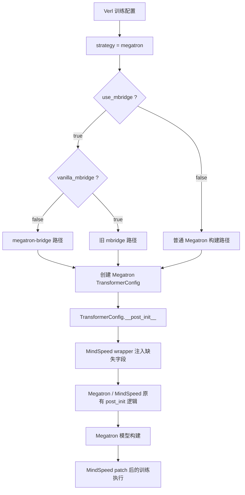
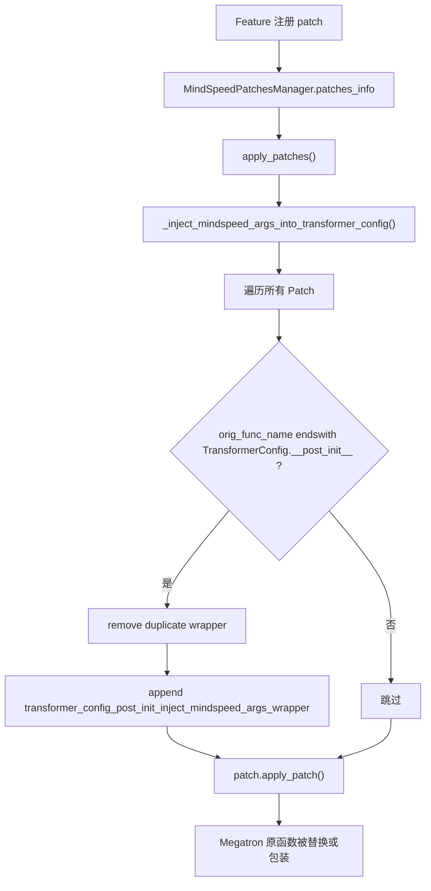
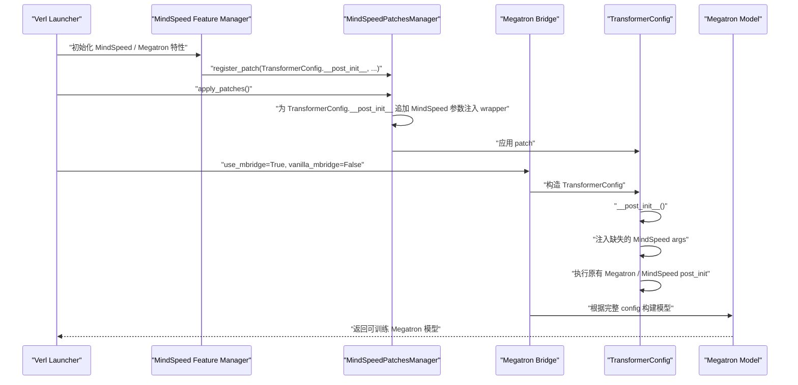
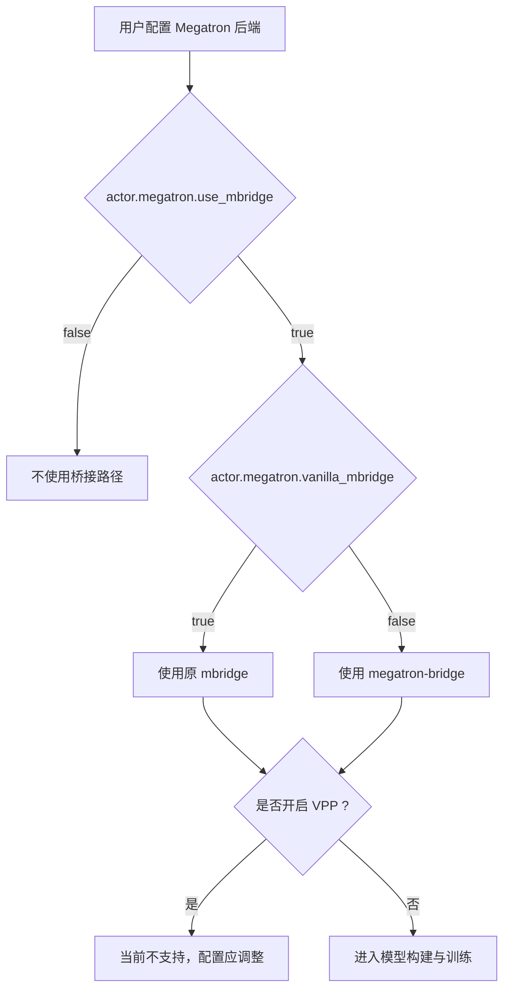

# Verl + MindSpeed 适配 Megatron Bridge 功能设计文档

## 1. 摘要

本文档描述 MindSpeed 在 `verl + MindSpeed` 训练场景下适配 `megatron-bridge` 的设计方案。该需求来源于 MindSpeed PR [#3268](https://gitcode.com/Ascend/MindSpeed/pull/3268)，核心目标是在 Verl 使用 Megatron 后端并开启 Megatron Bridge 模型构建/转换路径时，保证 MindSpeed 自定义训练特性能够正确注入到 Megatron 的 `TransformerConfig` 中。

本设计属于对既有实现的反向整理。实现重点不在于重写 Verl 或 Megatron Bridge，而是在 MindSpeed patch 框架中补齐一层配置兼容逻辑：当 Megatron Bridge 创建并初始化 `TransformerConfig` 时，自动把 MindSpeed 侧扩展的配置项注入到 config 对象中，使后续 MindSpeed 特性 patch、融合算子、并行配置和训练逻辑能够读取到预期字段。

## 2. 功能概述

### 2.1 背景

Verl 支持通过 Megatron 作为训练后端运行大模型训练。在该场景中，模型配置、权重加载、模型构建和训练并不是单纯由 MindSpeed 脚本直接完成，而是由 Verl、Megatron、MindSpeed 以及模型桥接逻辑共同参与。

在原有 `mbridge` 场景下，Verl 可以通过如下配置开启模型桥接：

```yaml
actor_rollout_ref.actor.megatron.use_mbridge: true
```

随着 Megatron Bridge 的引入，Verl 侧需要区分两类桥接路径：

```yaml
# 旧 mbridge 路径
actor_rollout_ref.actor.megatron.use_mbridge: true
actor_rollout_ref.actor.megatron.vanilla_mbridge: true

# megatron-bridge 路径
actor_rollout_ref.actor.megatron.use_mbridge: true
actor_rollout_ref.actor.megatron.vanilla_mbridge: false
```

问题在于：Megatron Bridge 会直接参与 Megatron 模型配置的构造和初始化。MindSpeed 的很多功能并不是 Megatron 原生字段，而是通过 MindSpeed 参数体系和 patch 机制扩展出来的字段。例如融合 RoPE、融合 SwiGLU、融合 RMSNorm、MoE Grouped GEMM、CP、重计算、分布式优化器等配置，都可能依赖 `TransformerConfig` 上存在对应属性。

如果 Megatron Bridge 创建的 `TransformerConfig` 没有携带这些 MindSpeed 扩展字段，后续 MindSpeed patch 或 Megatron 模型构建逻辑就可能出现以下问题：

- 访问不存在的属性，触发 `AttributeError`。
- MindSpeed 特性虽然在 Verl 配置中打开，但进入模型构建后没有生效。
- 部分默认值缺失，导致 Megatron 原生校验或 MindSpeed 扩展校验行为不一致。
- Verl 的 `override_transformer_config` 与 MindSpeed 参数体系之间缺少统一落点。

### 2.2 目的

本需求的目标是让 `verl + MindSpeed + megatron-bridge` 组合路径具备可用的配置兼容能力：

- Verl 通过 `use_mbridge=True`、`vanilla_mbridge=False` 选择 Megatron Bridge 路径。
- MindSpeed 自定义参数能够在 `TransformerConfig.__post_init__` 阶段补齐到 config 对象中。
- 已经由 Megatron Bridge 或 Verl 显式设置的 config 字段不被 MindSpeed 默认值覆盖。
- MindSpeed 既有 patch 机制和功能注册机制不被破坏。
- 文档中明确 `mbridge` 与 `megatron-bridge` 的配置方式，以及二者当前均不支持与 VPP 同时开启。

### 2.3 非目标

本需求不解决以下问题：

- 不实现 Megatron Bridge 本身的模型转换逻辑。
- 不改变 Verl 的训练主循环。
- 不改变 Verl 配置 schema 的根本结构。
- 不保证所有 MindSpeed 特性在 Megatron Bridge 路径下都达到正式发布质量。
- 不支持 `mbridge` 或 `megatron-bridge` 与 VPP 同时开启。
- 不替代 `override_transformer_config`，而是为 MindSpeed 扩展字段提供兜底注入。

## 3. 术语说明

| 名称 | 含义 |
| --- | --- |
| Verl | 面向大模型强化学习训练的框架，可使用 Megatron 作为 actor 训练后端 |
| MindSpeed | 面向昇腾 NPU 的大模型训练加速与 Megatron 适配框架 |
| Megatron | 大模型分布式训练框架，提供模型并行、流水并行、张量并行等能力 |
| mbridge | Verl 中原有的 Megatron 模型桥接路径 |
| megatron-bridge | 新的 Megatron Bridge 模型桥接路径，本文档讨论的适配重点 |
| `TransformerConfig` | Megatron Core 模型配置对象，模型构建与特性开关的重要承载点 |
| `override_transformer_config` | Verl 配置中用于向 Megatron `TransformerConfig` 透传配置的字段 |
| `__post_init__` | dataclass 初始化后的回调阶段，Megatron 在此进行 config 校验和派生字段处理 |
| Patch Manager | MindSpeed 的 patch 注册与应用机制，用于替换或包装 Megatron 原生函数 |
| VPP | Virtual Pipeline Parallel，虚拟流水并行 |

## 4. 需求分析

### 4.1 业务场景

典型使用方式是用户在 Verl 训练配置中选择 Megatron 后端，并打开 MindSpeed 相关优化：

```yaml
actor_rollout_ref:
  actor:
    strategy: megatron
    megatron:
      use_mbridge: true
      vanilla_mbridge: false
      tensor_model_parallel_size: 2
      pipeline_model_parallel_size: 1
      override_transformer_config:
        use_flash_attn: true
        position_embedding_type: rope
        use_fused_rotary_pos_emb: true
        swiglu: true
        use_fused_swiglu: true
        normalization: RMSNorm
        use_fused_rmsnorm: true
```

在这条路径上，用户期望：

- Verl 负责调度训练任务。
- Megatron Bridge 负责模型配置和权重桥接。
- MindSpeed 负责 Megatron 侧的 NPU 适配和性能优化。
- 用户写在 Verl 配置里的 MindSpeed 特性可以真实影响 Megatron 模型构建。

### 4.2 关键问题

Megatron 原生 `TransformerConfig` 并不知道 MindSpeed 后续扩展出来的所有字段。MindSpeed 在普通 Megatron 训练脚本中可以通过自身参数解析和特性注册流程保证这些字段存在，但 Megatron Bridge 路径改变了配置创建入口，导致部分 MindSpeed 字段可能没有进入 `TransformerConfig`。

因此，问题不是某一个具体特性的 patch 写错，而是配置对象的扩展字段缺少统一注入点。

### 4.3 设计约束

该需求有几个重要约束：

- 注入逻辑必须足够靠前，至少要早于 Megatron 和 MindSpeed 对 `TransformerConfig` 字段的校验与使用。
- 注入逻辑不能覆盖 Megatron Bridge 或 Verl 已经显式设置的字段。
- 不能破坏 MindSpeed 已有 patch wrapper 的组合关系。
- 不能只适配某一个具体模型或某一个具体 Verl 脚本。
- 需要同时兼容普通 `TransformerConfig` 以及名称以 `TransformerConfig` 结尾的派生配置类。

## 5. 实现思路描述

### 5.1 总体思路

实现采用“中心化配置补齐”的方式：不在每个 Megatron Bridge 调用点单独补字段，而是在 MindSpeed patch 应用阶段，识别所有注册到 `TransformerConfig.__post_init__` 的 patch，并统一追加一个 wrapper。

该 wrapper 的职责很单一：

1. 从 MindSpeed 参数体系中获取带默认值的参数集合。
2. 遍历这些参数。
3. 如果当前 `TransformerConfig` 对象没有某个属性，则把该属性补上。
4. 调用原始 `__post_init__` 逻辑，让 Megatron 和其他 MindSpeed wrapper 继续执行。

核心伪代码如下：

```python
def transformer_config_post_init_inject_mindspeed_args_wrapper(fn):
    @wraps(fn)
    def wrapper(self):
        from mindspeed.args_utils import get_mindspeed_args

        args = get_mindspeed_args(get_defaults=True)
        for key, value in vars(args).items():
            if not hasattr(self, key):
                setattr(self, key, value)
        return fn(self)

    return wrapper
```

### 5.2 为什么选择 `TransformerConfig.__post_init__`

`TransformerConfig` 是模型构建过程中最核心的配置对象。相比在 Verl 层或 Megatron Bridge 层做适配，把逻辑放在 `__post_init__` 阶段有几个优势：

- 覆盖面更稳定：只要最终会初始化 Megatron `TransformerConfig`，就能触发注入逻辑。
- 时机足够早：后续模型构建、字段校验、融合特性判断都能看到补齐后的字段。
- 对调用方透明：Verl 和 Megatron Bridge 不需要显式调用 MindSpeed 注入函数。
- 与 MindSpeed patch 框架一致：MindSpeed 本身就是通过 patch 机制适配 Megatron。

### 5.3 为什么只补缺失字段

注入逻辑使用如下判断：

```python
if not hasattr(self, key):
    setattr(self, key, value)
```

这意味着 MindSpeed 默认参数只作为兜底值，不覆盖已有字段。这样可以保证优先级清晰：

```text
Megatron Bridge / Verl 显式设置
> Megatron 原生配置字段
> MindSpeed 默认兜底字段
```

如果用户通过 `override_transformer_config` 显式指定了某个值，该值应当保留，不应被 MindSpeed 默认值覆盖。

### 5.4 为什么接入 Patch Manager

PR 中在 `MindSpeedPatchesManager.apply_patches()` 前增加了统一处理：

```python
@staticmethod
def apply_patches():
    MindSpeedPatchesManager._inject_mindspeed_args_into_transformer_config()
    for patch in MindSpeedPatchesManager.patches_info.values():
        patch.apply_patch()
```

这样做的原因是 patch 注册是分散发生的，各个 MindSpeed feature 都可能注册自己的 Megatron patch。如果在 feature 内部单独处理 Megatron Bridge 兼容，会导致逻辑分散且难以维护。

Patch Manager 是所有 patch 生效前的集中入口，适合做这类横切兼容逻辑。

## 6. 实现设计

### 6.1 总体架构图



### 6.2 Patch Manager 设计图



### 6.3 运行时序图



### 6.4 配置选择流程



## 7. 关键接口设计

### 7.1 `MindSpeedPatchesManager._inject_mindspeed_args_into_transformer_config`

接口职责：

- 在 patch 真正应用前，扫描所有已注册 patch。
- 找到目标函数名以 `TransformerConfig.__post_init__` 结尾的 patch。
- 移除已经存在的同名 wrapper，避免多次调用 `apply_patches()` 时重复包装。
- 将 MindSpeed 参数注入 wrapper 追加到 wrapper 列表中。

设计要点：

- 使用 `endswith("TransformerConfig.__post_init__")`，可以覆盖普通 `TransformerConfig`，也可以覆盖名称后缀符合该模式的派生 config。
- 不直接替换 patch 的原始函数，避免破坏其它 MindSpeed feature 已经注册的 wrapper。
- 通过 `remove_wrappers` 保证幂等性。

### 7.2 `transformer_config_post_init_inject_mindspeed_args_wrapper`

接口职责：

- 包装 Megatron `TransformerConfig.__post_init__`。
- 在原始 post-init 逻辑执行前补齐 MindSpeed 扩展参数。

输入输出：

```python
def transformer_config_post_init_inject_mindspeed_args_wrapper(fn):
    ...
    return wrapper
```

其中：

- `fn` 是被包装的 `__post_init__` 函数。
- `wrapper(self)` 中的 `self` 是 `TransformerConfig` 实例。
- 返回值与原 `fn(self)` 保持一致。

字段注入规则：

```text
for each key/value in get_mindspeed_args(get_defaults=True):
    if TransformerConfig does not have key:
        set key/value on TransformerConfig
```

### 7.3 Verl 文档配置接口

文档中明确两种桥接方式：

| 模式 | 配置 |
| --- | --- |
| mbridge | `actor_rollout_ref.actor.megatron.use_mbridge=True` + `actor_rollout_ref.actor.megatron.vanilla_mbridge=True` |
| megatron-bridge | `actor_rollout_ref.actor.megatron.use_mbridge=True` + `actor_rollout_ref.actor.megatron.vanilla_mbridge=False` |

同时明确限制：

```text
mbridge 和 megatron-bridge 暂不支持同时开启 VPP。
VPP 应在未开启 mbridge 或 megatron-bridge 时使用。
```

## 8. 与既有功能的关系

### 8.1 与 `override_transformer_config` 的关系

`override_transformer_config` 仍然是 Verl 侧向 Megatron config 传递用户显式配置的主要入口。MindSpeed 注入 wrapper 不替代它，而是兜底补齐 MindSpeed 扩展字段。

推荐理解为：

```text
override_transformer_config: 用户显式想打开或修改的功能
MindSpeed args injection: 保证 MindSpeed 扩展字段在 config 上存在
```

### 8.2 与 MindSpeed Feature Manager 的关系

MindSpeed Feature Manager 负责根据参数注册 patch。Megatron Bridge 适配不改变 feature 注册方式，而是在 patch 应用前对 `TransformerConfig.__post_init__` 相关 patch 做统一增强。

因此，该设计不会要求每个 feature 单独判断当前是否处于 Verl 或 Megatron Bridge 场景。

### 8.3 与 Megatron Basic Feature 的关系

PR 中还对 `mindspeed/features_manager/megatron_basic/megatron_basic.py` 做了辅助调整，包括：

- 引入 logger，避免兼容修复失败时静默吞异常。
- 在 Megatron 训练模块导入后修复 `modelopt.torch` 模块树的异常状态。
- 额外注册 `report_memory` 和 `get_model` 相关 patch。

这些改动不是 Megatron Bridge 适配的主逻辑，但属于 Verl/Megatron 组合场景下的基础兼容增强，有助于保持 Megatron 训练入口、内存上报和模型构建路径的一致性。

## 9. 兼容性与边界

### 9.1 兼容性

该方案对以下场景应保持兼容：

- 不使用 `mbridge` 的普通 Megatron 训练路径。
- 使用旧 `mbridge` 的 Verl + MindSpeed 路径。
- 使用 `megatron-bridge` 的 Verl + MindSpeed 路径。
- 已经存在其它 wrapper 包装 `TransformerConfig.__post_init__` 的场景。

兼容性的核心来源是：

- 只补缺失字段，不覆盖已有字段。
- 只对 `TransformerConfig.__post_init__` 相关 patch 追加 wrapper。
- 追加前移除同名 wrapper，避免重复包装。

### 9.2 当前边界

当前设计仍有以下边界：

- `mbridge` 和 `megatron-bridge` 暂不支持与 VPP 同时开启。
- 功能矩阵中多项 MindSpeed 能力仍标记为 Preview，需要以实际端到端训练验证为准。
- 如果未来 Megatron Bridge 改变 config 初始化路径，不再触发 Megatron `TransformerConfig.__post_init__`，则需要重新评估注入点。
- 如果 MindSpeed 参数名与 Megatron Bridge 新增字段重名，当前逻辑会保留已有字段，不会覆盖，这符合安全优先原则，但可能需要额外文档说明优先级。

## 10. 验证设计

### 10.1 静态检查

检查目标文件：

```text
mindspeed/patch_utils.py
docs/user-guide/verl.md
mindspeed/features_manager/megatron_basic/megatron_basic.py
```

检查点：

- `apply_patches()` 中是否先调用 `_inject_mindspeed_args_into_transformer_config()`。
- 注入函数是否只匹配 `TransformerConfig.__post_init__`。
- 是否通过 `remove_wrappers` 保证幂等。
- wrapper 是否使用 `get_mindspeed_args(get_defaults=True)`。
- wrapper 是否只对缺失字段执行 `setattr`。
- Verl 文档是否区分 `mbridge` 与 `megatron-bridge`。
- 文档是否说明 VPP 限制。

### 10.2 单元级验证

建议构造轻量测试覆盖以下行为：

1. `TransformerConfig` 缺少 MindSpeed 字段时，post-init 后字段被补齐。
2. `TransformerConfig` 已经存在同名字段时，字段值不被默认值覆盖。
3. 多次调用 `apply_patches()` 不会重复追加同一个 wrapper。
4. 非 `TransformerConfig.__post_init__` patch 不受影响。

示例断言逻辑：

```python
config = build_transformer_config(...)
assert hasattr(config, "use_flash_attn")
assert hasattr(config, "use_fused_swiglu")
assert hasattr(config, "use_fused_rmsnorm")
```

对于“不覆盖已有字段”的验证，可以预先设置一个字段：

```python
config.use_flash_attn = True
config.__post_init__()
assert config.use_flash_attn is True
```

### 10.3 端到端验证

端到端验证建议使用 Verl Megatron 后端，并分别验证两条路径：

```yaml
# 旧 mbridge
actor_rollout_ref.actor.megatron.use_mbridge: true
actor_rollout_ref.actor.megatron.vanilla_mbridge: true

# megatron-bridge
actor_rollout_ref.actor.megatron.use_mbridge: true
actor_rollout_ref.actor.megatron.vanilla_mbridge: false
```

重点观察：

- Megatron Bridge 路径是否能完成模型构建。
- `override_transformer_config` 中配置的 MindSpeed 特性是否进入 `TransformerConfig`。
- 训练是否能完成至少一个 step。
- 日志中是否没有 `TransformerConfig` 缺字段相关异常。
- 与旧 mbridge 路径相比，基础 loss、模型结构和训练行为是否符合预期。

### 10.4 回归验证

建议回归以下场景：

- 不开启 `use_mbridge` 的普通 Megatron 训练。
- 开启 `use_mbridge=True, vanilla_mbridge=True` 的旧 mbridge 训练。
- 开启 `use_mbridge=True, vanilla_mbridge=False` 的 megatron-bridge 训练。
- 打开常见 MindSpeed 融合优化项，例如 fused rope、fused swiglu、fused rmsnorm。
- 不开启任何额外 MindSpeed 融合优化，仅使用默认参数。

## 11. 风险分析

### 11.1 参数注入范围过大

当前实现会注入 `get_mindspeed_args(get_defaults=True)` 返回的全部 MindSpeed 参数。这样覆盖面强，但也可能让 `TransformerConfig` 携带很多当前模型不一定需要的字段。

缓解方式：

- 只补缺失字段，不覆盖已有字段。
- 字段只是 config 属性，不会自动打开功能；功能是否生效仍由具体 feature 和显式配置决定。
- 后续如果需要收敛范围，可以改为白名单注入，但当前阶段全量注入更能避免 Megatron Bridge 路径下遗漏字段。

### 11.2 wrapper 顺序敏感

`TransformerConfig.__post_init__` 可能已经被其它 MindSpeed feature 包装。如果注入 wrapper 顺序不当，可能导致其它 wrapper 在字段补齐前就访问字段。

缓解方式：

- 在 `apply_patches()` 中统一追加 wrapper，确保所有已注册 patch 进入最终应用阶段前被处理。
- PR 历史中已经从直接替换 patch 函数调整为追加 wrapper，减少破坏已有 wrapper 链的风险。

### 11.3 与未来 Megatron Bridge 版本变化耦合

如果未来 Megatron Bridge 更改配置构造方式，或者不再依赖 Megatron `TransformerConfig.__post_init__`，当前注入点可能失效。

缓解方式：

- 保留端到端 Megatron Bridge 验证用例。
- 在版本升级时重点检查 `TransformerConfig` 初始化路径。
- 必要时补充 Bridge 专属适配入口，但不建议一开始就分散到多个调用点。

### 11.4 VPP 限制

当前文档明确 `mbridge`、`megatron-bridge` 暂不支持与 VPP 同时开启。如果用户误配，可能出现模型切分、权重桥接或流水调度不一致的问题。

建议后续在配置校验层增加显式报错，而不仅仅依赖文档说明。

## 12. 后续优化方向

后续可以考虑以下增强：

- 增加配置校验：当 `use_mbridge=True` 且 VPP 开启时，直接给出清晰错误。
- 增加单元测试：覆盖 wrapper 注入、幂等性和不覆盖已有字段。
- 增加端到端测试脚本：分别覆盖 `mbridge` 与 `megatron-bridge`。
- 增加日志：在 debug 级别打印 Megatron Bridge 路径下关键 MindSpeed 字段是否完成注入。
- 收敛注入白名单：当支持矩阵稳定后，可以从全量 MindSpeed args 注入改为按需字段注入。

## 13. 结论

本设计通过在 MindSpeed patch 框架中统一包装 `TransformerConfig.__post_init__`，解决 `verl + MindSpeed + megatron-bridge` 路径下 MindSpeed 扩展配置字段缺失的问题。

该方案的关键优点是改动集中、对调用方透明、兼容既有 patch 机制，并且通过“不覆盖已有字段”的策略保证 Megatron Bridge 和 Verl 显式配置的优先级。配合 Verl 使用文档中对 `mbridge`、`megatron-bridge` 和 VPP 限制的说明，可以支撑用户在 Verl Megatron 后端下更清晰地使用 MindSpeed 训练能力。
